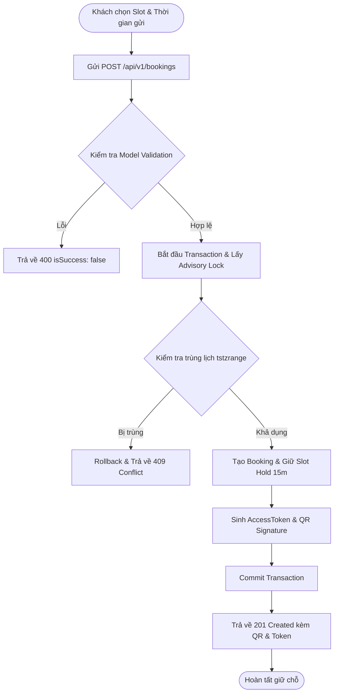
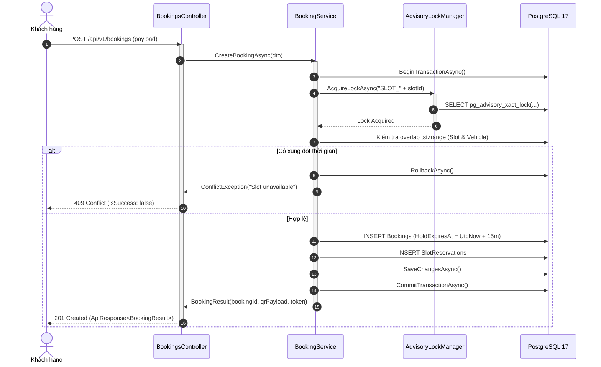

# 05 - ĐẶC TẢ GIAO DIỆN LẬP TRÌNH ỨNG DỤNG (API SPECIFICATION — BASELINE V4)

> Tuân thủ định dạng thiết kế chuẩn theo [APIDesignTemplate.md](file:///d:/FSOFT_FALL26_NET/Project.CleanArchitecture/Project.CleanArchitecture/docs/APIDesignTemplate.md) và quy trình phát triển theo [GitlabGuide.md](file:///d:/FSOFT_FALL26_NET/Project.CleanArchitecture/Project.CleanArchitecture/docs/GitlabGuide.md).

---

## 1. Tiêu chuẩn Chung & Khung Phản Hồi Chuẩn (Standard Response Envelope)
- **Base URL:** `http://localhost:5237/api/v1` (hoặc `https://localhost:7237/api/v1`)
- **Định dạng dữ liệu:** JSON (`application/json; charset=utf-8`)
- **API Versioning:** Luôn có tiền tố `/api/v1/` trong route.
- **Khung Phản hồi Chuẩn hóa (`ApiResponse<T>`):** Toàn bộ API của hệ thống bắt buộc phải bọc dữ liệu trả về theo cấu trúc chuẩn:

```csharp
public class ApiResponse<T>
{
    public T? Result { get; set; }
    public bool IsSuccess { get; set; }
    public int StatusCode { get; set; }
    public string Message { get; set; } = string.Empty;
}
```

### 1.1. Cấu trúc Response Thành công Mẫu (`200 OK` / `201 Created`)
```json
{
  "result": {
    "bookingId": "c9a01234-5678-90ab-cdef-1234567890ab",
    "bookingCode": "BK20261002-8X7A",
    "status": "Confirmed"
  },
  "isSuccess": true,
  "statusCode": 200,
  "message": "Booking created successfully."
}
```

### 1.2. Cấu trúc Response Lỗi Mẫu (`400 Bad Request` / `409 Conflict`)
```json
{
  "result": null,
  "isSuccess": false,
  "statusCode": 409,
  "message": "Slot B1-A01 đã được đặt trước bởi người khác trong khoảng thời gian này."
}
```

---

## 2. Tìm kiếm Bãi đỗ Thông minh (Smart Parking Search)

### 2.1. Tìm kiếm Bãi đỗ theo GPS & Tiêu chí Lọc
- **Method:** `GET`
- **URL:** `/api/v1/parking-lots/search`
- **Permission:** Public / Anonymous
- **Query Parameters:**
  - `latitude`: Vĩ độ GPS người dùng (bắt buộc nếu sort `NEAREST`).
  - `longitude`: Kinh độ GPS người dùng (bắt buộc nếu sort `NEAREST`).
  - `radiusKm`: Bán kính tìm kiếm (mặc định: 5.0 km).
  - `vehicleType`: Loại xe (`Motorbike`, `Car`).
  - `startTime`: Thời điểm bắt đầu dự kiến (ISO 8601).
  - `expectedDuration`: Thời lượng dự kiến gửi tính bằng phút (ví dụ: 180 cho 3 giờ).
  - `sortBy`: Tiêu chí sắp xếp (`NEAREST`: theo Haversine, `CHEAPEST`: theo tổng chi phí dự kiến).
  - `features`: Lọc tiện ích (ví dụ: `EV_CHARGING`, `COVERED`, `ACCESSIBLE`).
- **Phản hồi mẫu (`200 OK`):**
  ```json
  {
    "result": {
      "totalCount": 1,
      "items": [
        {
          "parkingLotId": "b1e2a3c4-5678-90ab-cdef-111122223333",
          "code": "LOT-Q1-01",
          "name": "Bãi đỗ xe Trung tâm Quận 1",
          "address": "123 Lê Lợi, Phường Bến Nghé, Quận 1, TP.HCM",
          "latitude": 10.776889,
          "longitude": 106.700806,
          "distanceKm": 1.25,
          "availableSlots": 45,
          "operatingStatus": "Active",
          "estimatedPricing": {
            "expectedDurationMinutes": 180,
            "estimatedTotalFee": 45000,
            "currency": "VND",
            "explanation": "15.000đ/giờ đầu x 3 giờ"
          },
          "supportedFeatures": ["EV_CHARGING", "COVERED"]
        }
      ]
    },
    "isSuccess": true,
    "statusCode": 200,
    "message": "Search completed successfully."
  }
  ```

---

## 3. Quản lý Đặt chỗ (`/api/v1/bookings`)

### 3.1. Tạo mới Booking (ExactSlot / AutoSlot)
- **Method:** `POST`
- **URL:** `/api/v1/bookings`
- **Permission:** Customer / Guest
- **Request Body:**
  ```json
  {
    "parkingLotId": "b1e2a3c4-5678-90ab-cdef-111122223333",
    "vehicleType": "Car",
    "normalizedPlate": "30H88888",
    "phoneNumber": "0987654321",
    "bookingMode": "ExactSlot",
    "slotId": "slot-uuid-101",
    "startAt": "2026-10-02T09:00:00Z",
    "endAt": "2026-10-02T12:00:00Z"
  }
  ```
- **Phản hồi thành công (`201 Created`):**
  ```json
  {
    "result": {
      "bookingId": "c9a01234-5678-90ab-cdef-1234567890ab",
      "bookingCode": "BK20261002-8X7A",
      "slotCode": "B1-A01",
      "levelCode": "B1",
      "status": "PendingPayment",
      "holdExpiresAt": "2026-10-02T09:15:00Z",
      "accessToken": "sec_9a8b7c6d5e4f3a2b1c0d",
      "qrTokenPayload": {
        "bookingId": "c9a01234-5678-90ab-cdef-1234567890ab",
        "nonce": "n_4f8a91",
        "expiresAt": "2026-10-02T09:30:00Z",
        "signature": "hmac_sha256_hash_here"
      }
    },
    "isSuccess": true,
    "statusCode": 201,
    "message": "Booking created. Please complete payment within 15 minutes."
  }
  ```

---

### 3.2. Sơ đồ Luồng Hoạt động (Activity Diagram — Create Booking)



---

### 3.3. Sơ đồ Trình tự (Sequence Diagram — Create Booking)



---

## 4. Check-In & Check-Out (`/api/v1/check-in`, `/api/v1/check-out`)

### 4.1. Check-In vào Bãi xe
- **Method:** `POST`
- **URL:** `/api/v1/check-in`
- **Request Body:**
  ```json
  {
    "parkingLotId": "b1e2a3c4-5678-90ab-cdef-111122223333",
    "gateCode": "GATE-IN-01",
    "normalizedPlate": "30H88888",
    "qrSignature": "hmac_sha256_hash_here",
    "bookingCode": "BK20261002-8X7A"
  }
  ```
- **Phản hồi (`200 OK`):**
  ```json
  {
    "result": {
      "sessionId": "ses-99112233-4455-6677",
      "status": "Active",
      "slotCode": "B1-A01",
      "entryTime": "2026-10-02T08:55:12Z",
      "barrierCommand": "OPEN"
    },
    "isSuccess": true,
    "statusCode": 200,
    "message": "Check-in successful. Barrier opened."
  }
  ```

### 4.2. Check-Out rời Bãi xe
- **Method:** `POST`
- **URL:** `/api/v1/check-out`
- **Request Body:**
  ```json
  {
    "parkingLotId": "b1e2a3c4-5678-90ab-cdef-111122223333",
    "gateCode": "GATE-OUT-01",
    "normalizedPlate": "30H88888"
  }
  ```
- **Phản hồi (`200 OK`):**
  ```json
  {
    "result": {
      "sessionId": "ses-99112233-4455-6677",
      "durationMinutes": 175,
      "finalFee": 45000,
      "paymentStatus": "Success",
      "barrierCommand": "OPEN"
    },
    "isSuccess": true,
    "statusCode": 200,
    "message": "Check-out successful. Vehicle physically exited."
  }
  ```

---

## 5. Thanh toán Trực tuyến VNPay (`/api/v1/payments`)
- **Tạo URL Thanh toán:** `POST /api/v1/payments/create-url` -> Trả về `paymentUrl` của VNPay Sandbox.
- **Webhook Callback (Idempotent):** `GET /api/v1/payment/vnpay/callback` -> Kiểm tra chữ ký bảo mật `vnp_SecureHash` và xử lý cập nhật trạng thái đơn đặt chỗ.
