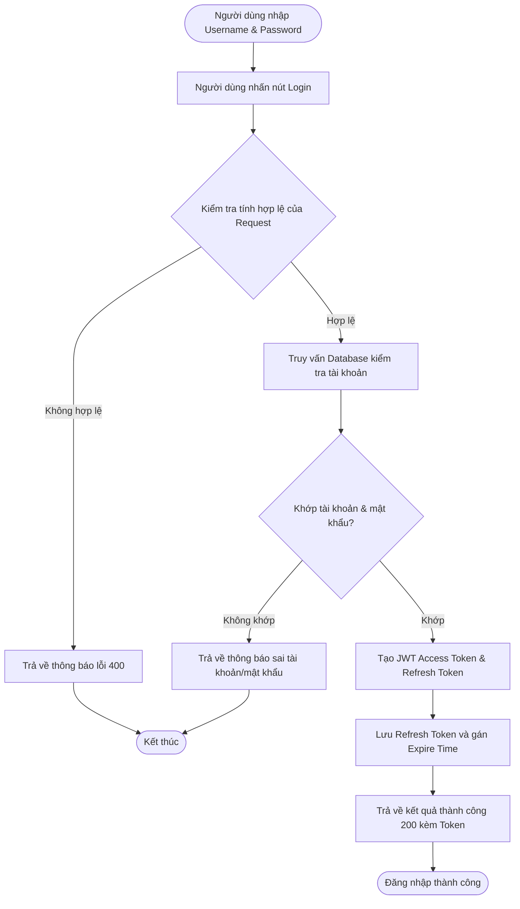
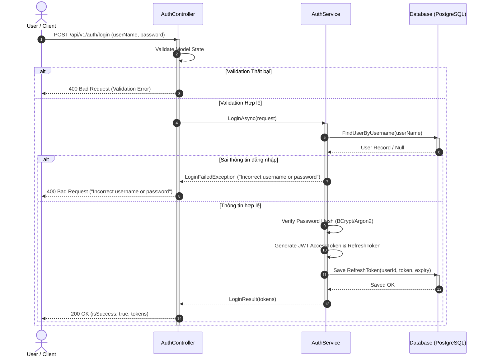

# HƯỚNG DẪN THIẾT KẾ API (API DESIGN TEMPLATE)

Tài liệu này định nghĩa cấu trúc chuẩn bắt buộc khi thiết kế một API endpoint mới cho hệ thống (đặc biệt áp dụng cho nhánh `features/Design_<UserStoryName>`).

---

## 1. Cấu Trúc Tổng Quan Thiết Kế API

Mỗi tài liệu thiết kế API phải bao gồm đầy đủ 6 phần:
1. **Overview (Tổng quan):** Mô tả mục đích và vai trò của API.
2. **API Specification (Đặc tả kỹ thuật):** HTTP Method, Endpoint URL, Phân quyền truy cập (Permission).
3. **Request Sample:** JSON Body mẫu và Bảng mô tả chi tiết từng trường dữ liệu.
4. **Response Sample:** Cấu trúc phản hồi chuẩn (`ApiResponse<T>`).
5. **Validation & Error Handling:** Danh sách mã lỗi, thông báo lỗi cụ thể cho từng trường hợp vi phạm.
6. **Diagrams:** Activity Diagram (Luồng hoạt động) & Sequence Diagram (Trình tự tương tác giữa các tầng Controller, Service, Database).

---

## 2. Quy Chuẩn Khung Phản Hồi Chuẩn (Standard API Response Envelope)

Mọi API của hệ thống bắt buộc phải bọc dữ liệu trả về theo cấu trúc `ApiResponse<T>`:

### 2.1. Phản hồi Thành công (Success Response — 200/201)
```json
{
  "result": {
    "accessToken": "eyJhbGciOiJIUzI1NiIsInR5cCI6IkpXVCJ9...",
    "refreshToken": "d7a1c883-12ab-4c34-8be0-3b4c5d6e7f8a"
  },
  "isSuccess": true,
  "statusCode": 200,
  "message": "Sign in successfully"
}
```

### 2.2. Phản hồi Lỗi Kiểm tra Dữ liệu (Validation Error — 400)
```json
{
  "result": null,
  "isSuccess": false,
  "statusCode": 400,
  "message": "userName is missing."
}
```

### 2.3. Phản hồi Sai Thông tin Xác thực (Authentication Error — 400 / 401)
```json
{
  "result": null,
  "isSuccess": false,
  "statusCode": 400,
  "message": "Incorrect username or password. Try again."
}
```

---

## 3. Ví Dụ Mẫu Hoàn Chỉnh (Sample: User Login API)

### 3.1. Overview
API cho phép người dùng đăng nhập vào hệ thống bằng tài khoản và mật khẩu, trả về JWT Access Token và Refresh Token nếu xác thực thành công.

### 3.2. API Specification
- **Method:** `POST`
- **URL:** `/api/v1/auth/login`
- **Permission:** Public / Anonymous (`N/A`)

### 3.3. Request Sample
```json
{
  "userName": "johndoe",
  "password": "Password@123"
}
```

**Bảng Đặc tả Dữ liệu Đầu vào (Fields):**

| Field | Description | Data Type | Required | Examples |
| :--- | :--- | :--- | :---: | :--- |
| `userName` | Tên đăng nhập tài khoản người dùng | `string` | Có | `"johndoe"` |
| `password` | Mật khẩu tài khoản người dùng | `string` | Có | `"Password@123"` |

### 3.4. Response Sample
```json
{
  "result": {
    "accessToken": "eyJhbGciOiJIUzI1Ni...",
    "refreshToken": "d7a1c883-12ab..."
  },
  "isSuccess": true,
  "statusCode": 200,
  "message": "Sign in successfully"
}
```

### 3.5. Validation & Error Codes

| Status Code | Description | Response Body Example |
| :---: | :--- | :--- |
| **400** | Thiếu trường username | `{"result": null, "isSuccess": false, "statusCode": 400, "message": "userName is missing."}` |
| **400** | Thiếu trường password | `{"result": null, "isSuccess": false, "statusCode": 400, "message": "password is missing."}` |
| **400** | Sai username hoặc password | `{"result": null, "isSuccess": false, "statusCode": 400, "message": "Incorrect username or password. Try again."}` |

---

### 3.6. Activity Diagram (Sơ đồ Luồng Hoạt động)



---

### 3.7. Sequence Diagram (Sơ đồ Trình tự Tương tác)


