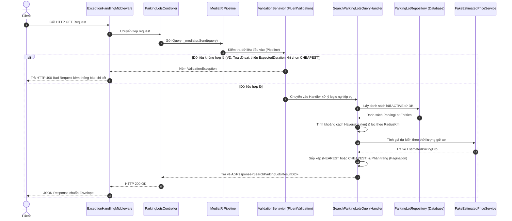

# TÀI LIỆU TỔNG HỢP KIẾN TRÚC & MÃ NGUỒN TÍNH NĂNG TÌM KIẾM BÃI ĐỖ XE (S2-03)
## Search Nearest / Cheapest Parking Lots with Clean Architecture & CQRS

---

## 1. Bức Tranh Tổng Quan & Vòng Đời Của Một Request (Request Lifecycle)

Khi ứng dụng Client (Mobile App / Web) gửi một HTTP request:
`GET /api/parking-lots/search?userLat=10.776&userLng=106.700&sortBy=NEAREST&expectedDuration=180`

### Sơ đồ tuần tự (Sequence Diagram):



---

## 2. Tổng Hợp Toàn Bộ Mã Nguồn & Chi Tiết Cú Pháp (Syntax)

---

### PHẦN I: TẦNG API & CHUẨN HÓA PHẢN HỒI (API & CONTRACTS)

#### 1. Chuẩn hóa phong bì phản hồi: `ApiResponse.cs`
- **Đường dẫn:** `src/Services/Parking/Parking.Parking.Api/Common/ApiResponse.cs`

```csharp
namespace Parking.Parking.Api.Common;

public class ApiResponse<T>
{
    public bool IsSuccess { get; set; }
    public int StatusCode { get; set; }
    public string Message { get; set; } = string.Empty;
    public T? Result { get; set; }

    public static ApiResponse<T> Success(T data, string message = "Success", int statusCode = 200) =>
        new() { IsSuccess = true, StatusCode = statusCode, Message = message, Result = data };

    public static ApiResponse<T> Fail(string message, int statusCode = 400) =>
        new() { IsSuccess = false, StatusCode = statusCode, Message = message, Result = default };
}
```

🔍 **Giải thích Cơ chế & Cú pháp:**
- **Generic `<T>`:** Cho phép class bọc bất kỳ kiểu dữ liệu nào (`SearchParkingLotsResultDto`, danh sách, object đơn lẻ...) mà vẫn giữ tính an toàn kiểu (Type Safety).
- **`T? Result`:** Dấu `?` đánh dấu thuộc tính này có thể là `null` (Nullable Reference Types). Khi API thất bại (`Fail`), trường này sẽ là `null`.
- **`static ApiResponse<T> Success(...) => new() { ... }`:**
  - `static`: Phương thức tĩnh (Factory Method) gọi trực tiếp thông qua tên class mà không cần `new ApiResponse<T>()`.
  - `=>`: Cú pháp **Expression-Bodied Method** viết gọn hàm 1 dòng.
  - `new()`: Cú pháp **Target-typed new expression** (C# 9+), compiler tự suy luận ra kiểu đối tượng dựa trên kiểu trả về của hàm.

---

#### 2. Bộ điều khiển API: `ParkingLotsController.cs`
- **Đường dẫn:** `src/Services/Parking/Parking.Parking.Api/Controllers/ParkingLotsController.cs`

```csharp
using MediatR;
using Microsoft.AspNetCore.Mvc;
using Parking.Parking.Api.Common;
using Parking.Parking.Application.DTOs;
using Parking.Parking.Application.Features.ParkingLots.Queries;

namespace Parking.Parking.Api.Controllers;

[ApiController]
[Route("api/parking-lots")]
public class ParkingLotsController : ControllerBase
{
    private readonly IMediator _mediator;

    public ParkingLotsController(IMediator mediator)
    {
        _mediator = mediator;
    }

    [HttpGet("search")]
    public async Task<ActionResult<ApiResponse<SearchParkingLotsResultDto>>> Search(
        [FromQuery] SearchParkingLotsQuery query,
        CancellationToken cancellationToken)
    {
        var result = await _mediator.Send(query, cancellationToken);
        return Ok(result);
    }
}
```

🔍 **Giải thích Cơ chế & Cú pháp:**
- **`[ApiController]`:** Attribute báo cho ASP.NET Core đây là Web API Controller, tự động kích hoạt tính năng Model Binding, tự động trả lỗi 400 nếu dữ liệu bind thất bại.
- **`[Route("api/parking-lots")]`:** Định nghĩa tiền tố đường dẫn URL cho toàn bộ Controller.
- **`[HttpGet("search")]`:** Ghép với route của Controller tạo thành endpoint hoàn chỉnh: `GET /api/parking-lots/search`.
- **`[FromQuery] SearchParkingLotsQuery query`:** Chỉ định Model Binder tự động đọc các tham số trên URL (`?userLat=...&userLng=...`) và gán vào các thuộc tính của object `query`.
- **`IMediator _mediator`:** Sử dụng **Dependency Injection (DI)** tiêm interface của MediatR vào Controller. Controller trở thành "Thin Controller" (Controller mỏng), không xử lý logic trực tiếp mà chuyển giao toàn bộ cho MediatR xử lý.

---

#### 3. Bắt lỗi tập trung toàn hệ thống: `ExceptionHandlingMiddleware.cs`
- **Đường dẫn:** `src/Services/Parking/Parking.Parking.Api/Middleware/ExceptionHandlingMiddleware.cs`

```csharp
using System.Text.Json;
using FluentValidation;
using Parking.Parking.Api.Common;

namespace Parking.Parking.Api.Middleware;

public class ExceptionHandlingMiddleware
{
    private readonly RequestDelegate _next;
    private readonly ILogger<ExceptionHandlingMiddleware> _logger;

    public ExceptionHandlingMiddleware(RequestDelegate next, ILogger<ExceptionHandlingMiddleware> logger)
    {
        _next = next;
        _logger = logger;
    }

    public async Task InvokeAsync(HttpContext context)
    {
        try
        {
            await _next(context); // Chuyển tiếp request tới Controller
        }
        catch (ValidationException ex)
        {
            _logger.LogWarning("Validation error: {Message}", ex.Message);
            context.Response.ContentType = "application/json";
            context.Response.StatusCode = StatusCodes.Status400BadRequest;

            var firstError = ex.Errors.FirstOrDefault()?.ErrorMessage ?? "Dữ liệu không hợp lệ.";
            var response = ApiResponse<object>.Fail(firstError, StatusCodes.Status400BadRequest);

            await context.Response.WriteAsync(JsonSerializer.Serialize(response));
        }
        catch (Exception ex)
        {
            _logger.LogError(ex, "Unhandled exception: {Message}", ex.Message);
            context.Response.ContentType = "application/json";
            context.Response.StatusCode = StatusCodes.Status500InternalServerError;

            var response = ApiResponse<object>.Fail("Đã có lỗi hệ thống xảy ra.", StatusCodes.Status500InternalServerError);
            await context.Response.WriteAsync(JsonSerializer.Serialize(response));
        }
    }
}
```

🔍 **Giải thích Cơ chế & Cú pháp:**
- **`RequestDelegate _next`:** Con trỏ đại diện cho middleware tiếp theo trong chuỗi HTTP Pipeline.
- **`try { await _next(context); } catch (...)`:** Toàn bộ ngoại lệ phát sinh trong quá trình xử lý request đều bị chặn và xử lý tại đây, không để ứng dụng crash.
- **Bắt riêng `ValidationException`:** Khi FluentValidation phát hiện lỗi, nó ném ngoại lệ này. Middleware chặn lại và trả về HTTP 400 kèm thông báo rõ ràng cho client thay vì trả về lỗi 500 mơ hồ.

---

### PHẦN II: TẦNG APPLICATION (CQRS, DTOs & BUSINESS LOGIC)

#### 4. Các đối tượng truyền dữ liệu (DTOs)
- **Đường dẫn:** `src/Services/Parking/Parking.Parking.Application/DTOs/`

```csharp
namespace Parking.Parking.Application.DTOs;

public record SearchParkingLotsResultDto
{
    public int TotalCount { get; init; }
    public IReadOnlyList<ParkingLotItemDto> Items { get; init; } = Array.Empty<ParkingLotItemDto>();
}

public record ParkingLotItemDto
{
    public Guid ParkingLotId { get; init; }
    public string Code { get; init; } = string.Empty;
    public string Name { get; init; } = string.Empty;
    public string Address { get; init; } = string.Empty;
    public double Latitude { get; init; }
    public double Longitude { get; init; }
    public double DistanceKm { get; init; }
    public int AvailableSlots { get; init; }
    public string OperatingStatus { get; init; } = string.Empty;
    public EstimatedPricingDto? EstimatedPricing { get; init; }
    public IReadOnlyList<string> SupportedFeatures { get; init; } = Array.Empty<string>();
}

public record EstimatedPricingDto
{
    public int ExpectedDurationMinutes { get; init; }
    public decimal EstimatedTotalFee { get; init; }
    public string Currency { get; init; } = "VND";
    public string? BillingDetails { get; init; }
}
```

🔍 **Giải thích Cơ chế & Cú pháp:**
- **`record`:** Cú pháp của C# định nghĩa kiểu tham chiếu có tính bất biến (Immutable) và so sánh theo giá trị thuộc tính (Value Equality), tối ưu cho DTOs.
- **`init`:** Thuộc tính chỉ được phép gán giá trị 1 lần duy nhất lúc khởi tạo (`object initialization`), không thể bị ghi đè sau đó.
- **`IReadOnlyList<T>`:** Giao diện danh sách chỉ đọc, đảm bảo dữ liệu sau khi tạo không bị thêm/bớt ngoài ý muốn.

---

#### 5. Truy vấn MediatR: `SearchParkingLotsQuery.cs`
- **Đường dẫn:** `src/Services/Parking/Parking.Parking.Application/Features/ParkingLots/Queries/SearchParkingLotsQuery.cs`

```csharp
using MediatR;
using Parking.Parking.Api.Common;
using Parking.Parking.Application.DTOs;

namespace Parking.Parking.Application.Features.ParkingLots.Queries;

public record SearchParkingLotsQuery : IRequest<ApiResponse<SearchParkingLotsResultDto>>
{
    public double UserLat { get; init; }
    public double UserLng { get; init; }
    public double RadiusKm { get; init; } = 10.0;
    public string SortBy { get; init; } = "NEAREST";
    public int? ExpectedDuration { get; init; } // Phút
    public string? VehicleType { get; init; }
    public int PageNumber { get; init; } = 1;
    public int PageSize { get; init; } = 10;
}
```

🔍 **Giải thích Cơ chế & Cú pháp:**
- **`IRequest<ApiResponse<SearchParkingLotsResultDto>>`:** Đây là "Hợp đồng" (Contract) của MediatR. Khi đối tượng Query này được gửi đi bằng `_mediator.Send()`, MediatR biết chắc chắn Handler trả về kiểu `ApiResponse<SearchParkingLotsResultDto>`.

---

#### 6. Kiểm tra hợp lệ dữ liệu: `SearchParkingLotsQueryValidator.cs`
- **Đường dẫn:** `src/Services/Parking/Parking.Parking.Application/Features/ParkingLots/Queries/SearchParkingLotsQueryValidator.cs`

```csharp
using FluentValidation;

namespace Parking.Parking.Application.Features.ParkingLots.Queries;

public class SearchParkingLotsQueryValidator : AbstractValidator<SearchParkingLotsQuery>
{
    public SearchParkingLotsQueryValidator()
    {
        RuleFor(x => x.UserLat)
            .InclusiveBetween(-90.0, 90.0)
            .WithMessage("Latitude phải nằm trong khoảng từ -90 đến 90 độ.");

        RuleFor(x => x.UserLng)
            .InclusiveBetween(-180.0, 180.0)
            .WithMessage("Longitude phải nằm trong khoảng từ -180 đến 180 độ.");

        RuleFor(x => x.RadiusKm)
            .GreaterThan(0)
            .WithMessage("Bán kính tìm kiếm phải lớn hơn 0 km.");

        RuleFor(x => x.SortBy)
            .Must(x => string.Equals(x, "NEAREST", StringComparison.OrdinalIgnoreCase) ||
                       string.Equals(x, "CHEAPEST", StringComparison.OrdinalIgnoreCase))
            .WithMessage("Tiêu chí sắp xếp phải là 'NEAREST' hoặc 'CHEAPEST'.");

        When(x => string.Equals(x.SortBy, "CHEAPEST", StringComparison.OrdinalIgnoreCase), () =>
        {
            RuleFor(x => x.ExpectedDuration)
                .NotNull().WithMessage("Cần cung cấp ExpectedDuration (số phút) khi sắp xếp theo CHEAPEST.")
                .GreaterThan(0).WithMessage("Thời gian gửi xe dự kiến phải lớn hơn 0 phút.");
        });

        RuleFor(x => x.PageNumber).GreaterThanOrEqualTo(1);
        RuleFor(x => x.PageSize).InclusiveBetween(1, 100);
    }
}
```

🔍 **Giải thích Cơ chế & Cú pháp:**
- **`AbstractValidator<T>`:** Class cơ sở từ FluentValidation cho phép cấu hình luật kiểm tra kiểu Fluent API mượt mà.
- **`When(condition, action)`:** Kiểm tra có điều kiện: Chỉ bắt buộc nhập `ExpectedDuration` khi người dùng chọn sắp xếp theo giá (`CHEAPEST`).
- **`StringComparison.OrdinalIgnoreCase`:** So sánh chuỗi nhị phân không phân biệt hoa thường, an toàn và tối ưu CPU.

---

#### 7. MediatR Pipeline Behavior: `ValidationBehavior.cs`
- **Đường dẫn:** `src/Services/Parking/Parking.Parking.Application/Behaviors/ValidationBehavior.cs`

```csharp
using FluentValidation;
using MediatR;

namespace Parking.Parking.Application.Behaviors;

public class ValidationBehavior<TRequest, TResponse> : IPipelineBehavior<TRequest, TResponse>
    where TRequest : IRequest<TResponse>
{
    private readonly IEnumerable<IValidator<TRequest>> _validators;

    public ValidationBehavior(IEnumerable<IValidator<TRequest>> validators)
    {
        _validators = validators;
    }

    public async Task<TResponse> Handle(
        TRequest request, 
        RequestHandlerDelegate<TResponse> next, 
        CancellationToken cancellationToken)
    {
        if (_validators.Any())
        {
            var context = new ValidationContext<TRequest>(request);
            var validationResults = await Task.WhenAll(
                _validators.Select(v => v.ValidateAsync(context, cancellationToken)));

            var failures = validationResults
                .SelectMany(r => r.Errors)
                .Where(f => f != null)
                .ToList();

            if (failures.Count != 0)
                throw new ValidationException(failures);
        }

        return await next(); // Dữ liệu hợp lệ -> chuyển tiếp vào Handler
    }
}
```

🔍 **Giải thích Cơ chế & Cú pháp:**
- **`IPipelineBehavior<TRequest, TResponse>`:** Đóng vai trò như Middleware chặn giữa các request MediatR.
- **`where TRequest : IRequest<TResponse>`:** Generic Constraint giới hạn phạm vi áp dụng.
- **`Task.WhenAll(...)`:** Chạy song song bất đồng bộ toàn bộ validator tìm được trong DI container trước khi quyết định cho request đi tiếp hay chặn lại.

---

#### 8. Xử lý logic nghiệp vụ cốt lõi: `SearchParkingLotsQueryHandler.cs`
- **Đường dẫn:** `src/Services/Parking/Parking.Parking.Application/Features/ParkingLots/Queries/SearchParkingLotsQueryHandler.cs`

```csharp
using MediatR;
using Parking.Parking.Api.Common;
using Parking.Parking.Application.DTOs;
using Parking.Parking.Application.Interfaces;

namespace Parking.Parking.Application.Features.ParkingLots.Queries;

public class SearchParkingLotsQueryHandler : IRequestHandler<SearchParkingLotsQuery, ApiResponse<SearchParkingLotsResultDto>>
{
    private readonly IParkingLotRepository _repository;
    private readonly IEstimatedPriceService _priceService;

    public SearchParkingLotsQueryHandler(
        IParkingLotRepository repository,
        IEstimatedPriceService priceService)
    {
        _repository = repository;
        _priceService = priceService;
    }

    public async Task<ApiResponse<SearchParkingLotsResultDto>> Handle(
        SearchParkingLotsQuery request,
        CancellationToken cancellationToken)
    {
        // 1. Lấy tất cả bãi đỗ đang ACTIVE từ CSDL
        var lots = await _repository.GetActiveParkingLotsAsync(cancellationToken);

        var items = new List<ParkingLotItemDto>();

        foreach (var lot in lots)
        {
            // 2. Tính khoảng cách Haversine giữa vị trí người dùng và bãi đỗ
            var distance = CalculateHaversineDistance(request.UserLat, request.UserLng, lot.Latitude, lot.Longitude);

            // Bỏ qua nếu bãi xe nằm ngoài bán kính tìm kiếm
            if (distance > request.RadiusKm) continue;

            // 3. Tính toán giá tiền dự kiến
            var duration = request.ExpectedDuration ?? 60;
            var pricing = await _priceService.EstimatePriceAsync(lot.Id, duration, request.VehicleType, cancellationToken);

            items.Add(new ParkingLotItemDto
            {
                ParkingLotId = lot.Id,
                Code = lot.Code,
                Name = lot.Name,
                Address = lot.Address,
                Latitude = lot.Latitude,
                Longitude = lot.Longitude,
                DistanceKm = Math.Round(distance, 2),
                AvailableSlots = lot.TotalCapacity,
                OperatingStatus = lot.Status,
                EstimatedPricing = pricing
            });
        }

        // 4. Sắp xếp kết quả theo yêu cầu
        if (string.Equals(request.SortBy, "CHEAPEST", StringComparison.OrdinalIgnoreCase))
        {
            items = items.OrderBy(x => x.EstimatedPricing?.EstimatedTotalFee ?? decimal.MaxValue)
                         .ThenBy(x => x.DistanceKm)
                         .ToList();
        }
        else
        {
            items = items.OrderBy(x => x.DistanceKm).ToList();
        }

        // 5. Phân trang (Pagination)
        var totalCount = items.Count;
        var pagedItems = items
            .Skip((request.PageNumber - 1) * request.PageSize)
            .Take(request.PageSize)
            .ToList();

        var result = new SearchParkingLotsResultDto
        {
            TotalCount = totalCount,
            Items = pagedItems
        };

        return ApiResponse<SearchParkingLotsResultDto>.Success(result);
    }

    // Công thức Haversine tính khoảng cách đường chim bay trên mặt cong Trái Đất (km)
    private static double CalculateHaversineDistance(double lat1, double lon1, double lat2, double lon2)
    {
        const double R = 6371.0; // Bán kính Trái Đất theo km
        var dLat = (lat2 - lat1) * Math.PI / 180.0;
        var dLon = (lon2 - lon1) * Math.PI / 180.0;

        var a = Math.Sin(dLat / 2.0) * Math.Sin(dLat / 2.0) +
                Math.Cos(lat1 * Math.PI / 180.0) * Math.Cos(lat2 * Math.PI / 180.0) *
                Math.Sin(dLon / 2.0) * Math.Sin(dLon / 2.0);

        var c = 2.0 * Math.Atan2(Math.Sqrt(a), Math.Sqrt(1.0 - a));
        return R * c;
    }
}
```

🔍 **Giải thích Cơ chế & Cú pháp:**
- **`IRequestHandler<TQuery, TResponse>`:** Interface của MediatR đánh dấu class này chuyên phụ trách xử lý loại query tương ứng.
- **`CancellationToken`:** Nhận tín hiệu ngắt từ tầng API để dừng tác vụ DB ngay lập tức nếu client hủy request (đóng app, rớt mạng).
- **`Skip((PageNumber - 1) * PageSize).Take(PageSize)`:** Cú pháp phân trang chuẩn của LINQ.
- **`?? decimal.MaxValue`:** Toán tử Null-Coalescing: Nếu bãi không tính được giá, tạm gán giá trị lớn nhất để đẩy bãi đó xuống cuối danh sách.

---

### PHẦN III: TẦNG INFRASTRUCTURE & MOCK SERVICES

#### 9. Repository truy vấn Database: `ParkingLotRepository.cs`
- **Đường dẫn:** `src/Services/Parking/Parking.Parking.Infrastructure/Repositories/ParkingLotRepository.cs`

```csharp
using Microsoft.EntityFrameworkCore;
using Parking.Parking.Application.Interfaces;
using Parking.Parking.Domain;
using Parking.Parking.Infrastructure.Persistence;

namespace Parking.Parking.Infrastructure.Repositories;

public class ParkingLotRepository : IParkingLotRepository
{
    private readonly ParkingDbContext _context;

    public ParkingLotRepository(ParkingDbContext context)
    {
        _context = context;
    }

    public async Task<IReadOnlyList<ParkingLot>> GetActiveParkingLotsAsync(CancellationToken cancellationToken)
    {
        return await _context.ParkingLots
            .AsNoTracking()
            .Where(p => p.Status == "ACTIVE")
            .ToListAsync(cancellationToken);
    }
}
```

🔍 **Giải thích Cơ chế & Cú pháp:**
- **`AsNoTracking()`:** Tắt cơ chế theo dõi thay đổi (Change Tracking) của Entity Framework Core. Do đây là câu lệnh đọc dữ liệu (Read-only), `AsNoTracking()` giúp tăng tốc độ truy vấn đáng kể và giảm dung lượng RAM tiêu thụ.

---

#### 10. Service giả lập tính giá: `FakeEstimatedPriceService.cs`
- **Đường dẫn:** `src/Services/Parking/Parking.Parking.Infrastructure/Services/FakeEstimatedPriceService.cs`

```csharp
using Parking.Parking.Application.DTOs;
using Parking.Parking.Application.Interfaces;

namespace Parking.Parking.Infrastructure.Services;

public class FakeEstimatedPriceService : IEstimatedPriceService
{
    public Task<EstimatedPricingDto> EstimatePriceAsync(
        Guid parkingLotId, 
        int expectedDurationMinutes, 
        string? vehicleType, 
        CancellationToken cancellationToken)
    {
        // Công thức Mock: 10.000 VNĐ mỗi 30 phút, tối thiểu 20.000 VNĐ
        var blocks = Math.Ceiling((double)expectedDurationMinutes / 30.0);
        var totalFee = (decimal)Math.Max(20000, blocks * 10000);

        var result = new EstimatedPricingDto
        {
            ExpectedDurationMinutes = expectedDurationMinutes,
            EstimatedTotalFee = totalFee,
            Currency = "VND",
            BillingDetails = $"Giá giả lập (Mock) cho đỗ xe {expectedDurationMinutes} phút."
        };

        return Task.FromResult(result);
    }
}
```

🔍 **Giải thích Cơ chế & Cú pháp:**
- **`Task.FromResult(result)`:** Giúp chuyển đổi một kết quả tính toán đồng bộ thành một `Task` bất đồng bộ đã hoàn thành, phù hợp với chữ ký hàm `Task<EstimatedPricingDto>` của interface.
- **Loose Coupling:** Nhờ có interface `IEstimatedPriceService`, sau này khi phân hệ Payment/Pricing hoàn thành, ta chỉ cần viết class `EstimatedPriceService` thật và đăng ký lại trong DI mà không cần sửa 1 dòng code nào trong `SearchParkingLotsQueryHandler`.

---

### PHẦN IV: ĐĂNG KÝ DEPENDENCY INJECTION (DI)

#### 11. Đăng ký Application Services: `DependencyInjection.cs`
- **Đường dẫn:** `src/Services/Parking/Parking.Parking.Application/DependencyInjection.cs`

```csharp
using System.Reflection;
using FluentValidation;
using MediatR;
using Microsoft.Extensions.DependencyInjection;
using Parking.Parking.Application.Behaviors;

namespace Parking.Parking.Application;

public static class DependencyInjection
{
    public static IServiceCollection AddApplicationServices(this IServiceCollection services)
    {
        var assembly = Assembly.GetExecutingAssembly();

        // Đăng ký MediatR cho toàn bộ assembly Application
        services.AddMediatR(cfg => cfg.RegisterServicesFromAssembly(assembly));

        // Tự động tìm và đăng ký tất cả các Validator kế thừa AbstractValidator
        services.AddValidatorsFromAssembly(assembly);

        // Đăng ký Pipeline Behavior kiểm tra tính hợp lệ
        services.AddTransient(typeof(IPipelineBehavior<,>), typeof(ValidationBehavior<,>));

        return services;
    }
}
```

---

## 3. Bảng Thuật Ngữ Cú Pháp & Nguyên Lý Lập Trình

| Cú pháp / Từ khóa | Ý nghĩa kỹ thuật | Vai trò thực tế trong dự án |
| :--- | :--- | :--- |
| **`record`** | Khai báo kiểu tham chiếu bất biến (Immutable Reference Type). | Giúp DTOs an toàn, tự so sánh dữ liệu theo giá trị, code ngắn gọn. |
| **`init`** | Thuộc tính chỉ được gán giá trị tại thời điểm tạo mới object. | Bảo vệ dữ liệu DTO không bị thay đổi dọc đường xử lý. |
| **`IRequest<T>`** | Interface đánh dấu Message trong MediatR. | Đại diện cho câu hỏi / lệnh truy vấn và chỉ rõ kiểu kết quả trả về. |
| **`IRequestHandler<T, R>`** | Interface xử lý Message của MediatR. | Nơi chứa logic nghiệp vụ; tách rời Controller khỏi Database logic. |
| **`IPipelineBehavior`** | Interceptor / Middleware chặn giữa request MediatR. | Thực hiện kiểm tra hợp lệ dữ liệu (Validation) trước khi tới Handler. |
| **`async / await`** | Cơ chế bất đồng bộ non-blocking I/O. | Tối ưu tài nguyên Server, không chiếm dụng luồng (thread pool) khi chờ DB. |
| **`CancellationToken`** | Token báo hiệu hủy bỏ tác vụ. | Lập tức giải phóng tài nguyên nếu Client ngắt kết nối giữa chừng. |
| **`Dependency Injection (DI)`** | Tiêm phụ thuộc qua Constructor. | Giúp code lỏng lẻo (Loose Coupling), dễ Unit Test và dễ bảo trì. |
| **`AsNoTracking()`** | Tắt Change Tracker của EF Core. | Tăng tốc độ đọc dữ liệu từ DB lên đến 2-3 lần cho tác vụ Read-only. |
| **Haversine Formula** | Công thức tính khoảng cách trên mặt cầu Trái Đất. | Tính chính xác khoảng cách (km) đường chim bay từ tọa độ GPS. |
