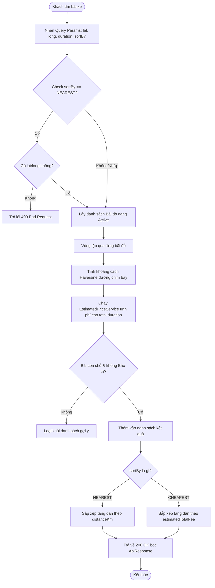
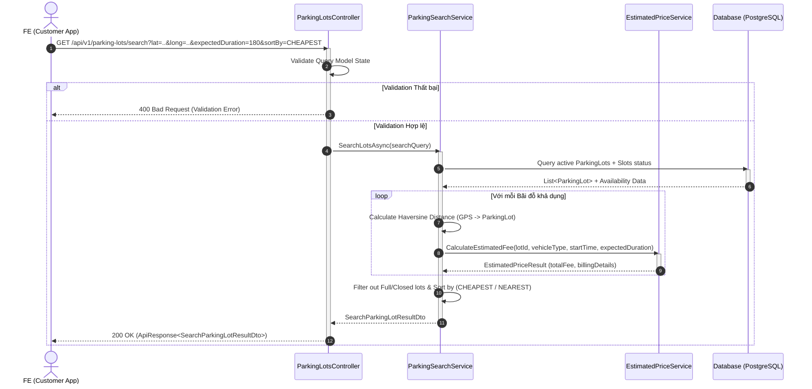

# THIẾT KẾ API: SEARCH NEAREST CHEAPEST & QUOTE TOÀN THỜI LƯỢNG (SCRUM-47 [S2-03])
- **Owner:** Sơn (TV07)
- **Task:** SCRUM-47 / S2-03
- **Sprint:** SCRUM Sprint 2
- **Trạng thái:** Design Phase (Draft)
---
## 1. Overview (Tổng quan)
API này cho phép người dùng (Guest hoặc Customer) tìm kiếm và lọc danh sách các bãi đỗ xe khả dụng dựa trên:
1. **`NEAREST` (Bãi đỗ gần nhất):** Áp dụng công thức Haversine tính khoảng cách đường chim bay từ vị trí GPS (`latitude`, `longitude`) của người dùng đến bãi xe.
2. **`CHEAPEST` (Bãi đỗ rẻ nhất):** Chạy động cơ tính giá động (`EstimatedPriceService`) để tính toàn bộ chi phí dự kiến cho tổng thời lượng gửi xe (`expectedDuration`), tính đến trần giá ngày (`daily cap`), phụ phí khung giờ đêm (`multiplier`), và đơn vị block 15 phút.
3. **Lọc trạng thái khả dụng (Availability):** Loại bỏ các bãi đỗ bị đóng cửa (`Closed`), đang bảo trì (`Maintenance`), hoặc đã hết chỗ đỗ (`Full`).
---
## 2. API Specification (Đặc tả Kỹ thuật)
- **Method:** `GET`
- **URL Endpoint:** `/api/v1/parking-lots/search`
- **Permission:** Public / Anonymous (`N/A`)
---
## 3. Request Sample (Mẫu Dữ liệu Đầu vào)
### Query Parameters Mẫu:
`/api/v1/parking-lots/search?latitude=10.776889&longitude=106.700806&radiusKm=5.0&vehicleType=Car&expectedDuration=180&sortBy=CHEAPEST`
### Bảng Đặc tả Chi tiết Các Trường Query:
| Field | Description | Data Type | Required | Default | Examples / Constrains |
| :--- | :--- | :--- | :---: | :---: | :--- |
| `latitude` | Vĩ độ GPS vị trí người dùng | `double` | Có (nếu `sortBy=NEAREST`) | N/A | `10.776889` |
| `longitude` | Kinh độ GPS vị trí người dùng | `double` | Có (nếu `sortBy=NEAREST`) | N/A | `106.700806` |
| `radiusKm` | Bán kính tìm kiếm (km) | `double` | Không | `5.0` | `5.0` (Bán kính tối đa 50km) |
| `vehicleType` | Loại phương tiện gửi | `string` | Có | `"Car"` | `"Car"`, `"Motorbike"` |
| `startTime` | Thời điểm bắt đầu dự kiến gửi | `DateTime (ISO 8601)` | Không | `UtcNow` | `"2026-10-07T09:00:00Z"` |
| `expectedDuration` | Thời lượng dự kiến gửi (phút) | `int` | Có | `60` | `180` (Tương đương 3 giờ) |
| `sortBy` | Tiêu chí sắp xếp kết quả | `string` | Không | `"NEAREST"` | `"NEAREST"`, `"CHEAPEST"` |
---
## 4. Response Sample (Mẫu Dữ liệu Trả về)
Khung phản hồi chuẩn bọc trong `ApiResponse<SearchParkingLotResultDto>`:
```json
{
  "result": {
    "totalCount": 2,
    "items": [
      {
        "parkingLotId": "b1e2a3c4-5678-90ab-cdef-111122223333",
        "code": "LOT-Q1-01",
        "name": "Bãi đỗ xe Trung tâm Quận 1",
        "address": "123 Lê Lợi, Phường Bến Nghé, Quận 1, TP.HCM",
        "latitude": 10.776889,
        "longitude": 106.700806,
        "distanceKm": 1.25,
        "availableSlots": 45,
        "operatingStatus": "Active",
        "estimatedPricing": {
          "expectedDurationMinutes": 180,
          "estimatedTotalFee": 45000,
          "currency": "VND",
          "billingDetails": "Block 15 phút - 15.000đ/giờ đầu"
        },
        "supportedFeatures": ["EV_CHARGING", "COVERED"]
      }
    ]
  },
  "isSuccess": true,
  "statusCode": 200,
  "message": "Search completed successfully."
}
```

---
## 5. Validation & Error Handling (Xử lý Lỗi & Mã Lỗi)
| Status Code | Message | Nguyên nhân |
| :---: | :--- | :--- |
| **400** | `latitude and longitude are required when sorting by NEAREST.` | Người dùng chọn `sortBy=NEAREST` nhưng không truyền GPS |
| **400** | `expectedDuration must be greater than 0.` | Truyền thời lượng gửi xe `<= 0` phút |
| **422** | `Unsupported pricing rule for parking lot LOT-XXX.` | Bãi xe chưa cấu hình biểu giá phù hợp với `vehicleType` |
---
## 6. Diagrams (Sơ đồ Thiết kế)
### 6.1. Activity Diagram (Sơ đồ Luồng Hoạt động)

## 6.2. Sequence Diagram (Sơ đồ Trình tự Tương tác)
