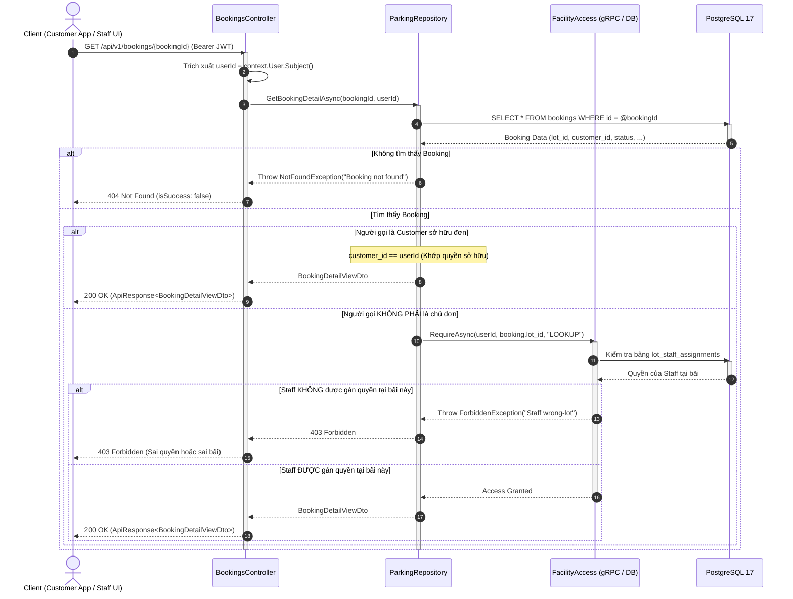

# THIẾT KẾ API: AVAILABILITY LOOKUP, BOOKING DETAIL & HOLD EXPIRY WORKER (SCRUM-48 [S2-04])
- **Owner:** Hàn (TV6)
- **Task:** SCRUM-48 / S2-04
- **Sprint:** SCRUM Sprint 2
- **Trạng thái:** Design Phase (Draft)
- **Phối hợp:** Sơn (Payment), Tiến (Staff UI), A.Đức (QR/FE), Quang (Acceptance / CI-CD)

---

## 1. Overview (Tổng quan Nghiệp vụ)

Tài liệu này đặc tả chi tiết kiến trúc kỹ thuật cho User Story **S2-04** thuộc phân hệ Parking Core Service:
1. **API Tra cứu Khả dụng Vị trí đỗ (Availability Lookup):** Cung cấp thông tin trạng thái các slot đỗ xe trong bãi theo khung thời gian dự kiến `[StartAt, EndAt)` và loại phương tiện.
   - *Nguyên tắc cốt lõi:* Dữ liệu trả về chỉ mang tính tham khảo (Snapshot View). Mọi thao tác ghi (`Write Booking`) bắt buộc phải re-check trong Transaction với **PostgreSQL Advisory Lock** và **GiST Overlap Exclusion Constraint**.
2. **API Tra cứu Chi tiết Đơn đặt chỗ (Booking Detail Lookup):** Cung cấp dữ liệu chi tiết booking cho giao diện người dùng (Customer App) và nhân viên cổng (Staff UI).
   - *Bảo mật & Phân quyền:* Áp dụng chặt chẽ **Facility-Scoped RBAC & Resource Ownership**. Khách chỉ được xem vé của mình; Staff chỉ được xem vé của bãi mình phụ trách. Bất kỳ vi phạm nào đều trả về lỗi `403 Forbidden`.
3. **Background Worker Quét Hết Hạn Giữ Chỗ (Hold Expiry Worker):** Dịch vụ chạy ngầm định kỳ (chu kỳ 10 giây) tự động quét và giải phóng các booking `PENDING_PAYMENT` đã quá hạn 15 phút.
   - *Bất biến sống còn (Invariants):* 
     - Tuyệt đối không giải phóng slot nếu xe vật lý đang chiếm chỗ thực tế (`session_slot_assignments.vacated_at IS NULL`).
     - Tuyệt đối không tự ý đổi đơn `CONFIRMED` sang `AVAILABLE` ngầm.
     - Tuân thủ thứ tự khóa tài nguyên chống deadlock: `VEHICLE` -> `SLOT`.

---

## 2. API 1: Tra cứu Khả dụng Bãi xe (Availability Lookup)

- **Method:** `GET`
- **URL Endpoint:** `/api/v1/parking-lots/{lotId}/availability`
- **Permission:** Public / Customer / Staff (`Anonymous` hoặc `Authenticated`)

### 2.1. Request Parameters (Tham số Đầu vào)
| Param | Vị trí | Data Type | Bắt buộc | Mặc định | Mô tả & Ràng buộc |
| :--- | :--- | :--- | :---: | :---: | :--- |
| `lotId` | Path | `Guid` | Có | N/A | ID định danh của bãi đỗ xe |
| `startTime` | Query | `DateTimeOffset` | Không | `UtcNow` | Thời điểm bắt đầu dự kiến (ISO 8601) |
| `endTime` | Query | `DateTimeOffset` | Không | `startTime + 60m` | Thời điểm kết thúc dự kiến (`endTime > startTime`) |
| `vehicleType` | Query | `string` | Không | All | Lọc theo loại xe (`Car`, `Motorbike`) |
| `levelId` | Query | `Guid` | Không | All | Lọc theo tầng cụ thể (`ParkingLevelId`) |

### 2.2. Response Sample (Mẫu Phản hồi `200 OK`)
Khung phản hồi chuẩn bọc trong `ApiResponse<LotAvailabilityViewDto>`:
```json
{
  "result": {
    "lotId": "b1e2a3c4-5678-90ab-cdef-111122223333",
    "lotCode": "LOT-Q1-01",
    "queryRange": {
      "startsAt": "2026-10-08T09:00:00Z",
      "endsAt": "2026-10-08T12:00:00Z"
    },
    "totalSlots": 120,
    "availableCount": 85,
    "heldCount": 10,
    "occupiedCount": 20,
    "maintenanceCount": 5,
    "levels": [
      {
        "levelId": "lvl-aaaa-1111",
        "levelCode": "B1",
        "levelName": "Tầng hầm B1",
        "slots": [
          {
            "slotId": "slot-0001-2222",
            "slotCode": "B1-A01",
            "zoneCode": "ZONE-A",
            "supportedVehicleTypes": ["Car"],
            "features": ["EV_CHARGING", "COVERED"],
            "status": "AVAILABLE"
          },
          {
            "slotId": "slot-0002-3333",
            "slotCode": "B1-A02",
            "zoneCode": "ZONE-A",
            "supportedVehicleTypes": ["Car"],
            "features": ["COVERED"],
            "status": "HELD"
          }
        ]
      }
    ]
  },
  "isSuccess": true,
  "statusCode": 200,
  "message": "Lot availability retrieved successfully."
}
```

---

## 3. API 2: Tra cứu Chi tiết Booking (Booking Detail Lookup)

- **Method:** `GET`
- **URL Endpoint:** `/api/v1/bookings/{bookingId}`
- **Permission:** `Authorized` (`Customer` sở hữu hoặc `Staff`/`Manager` cùng cơ sở)
- **Header:** `Authorization: Bearer <JWT_TOKEN>`

### 3.1. Phân quyền Facility-Scoped RBAC & Ownership
1. **Khách hàng (Customer):** Token JWT chứa `sub = customerId`. Hệ thống kiểm tra `booking.customer_id == sub`. Nếu không khớp -> **Trả về 403 Forbidden**.
2. **Nhân viên (Staff):** Gọi `IFacilityAccess.RequireAsync(staffId, booking.lot_id, "LOOKUP", ct)`. Nếu nhân viên không được gán quyền tại bãi đó trong bảng `lot_staff_assignments` -> **Trả về 403 Forbidden**.

### 3.2. Response Sample (Mẫu Phản hồi `200 OK`)
Khung phản hồi chuẩn bọc trong `ApiResponse<BookingDetailViewDto>`:
```json
{
  "result": {
    "bookingId": "c9a01234-5678-90ab-cdef-1234567890ab",
    "bookingCode": "BK20261008-8X7A",
    "lotId": "b1e2a3c4-5678-90ab-cdef-111122223333",
    "lotName": "Bãi đỗ xe Trung tâm Quận 1",
    "slotId": "slot-0001-2222",
    "slotCode": "B1-A01",
    "levelCode": "B1",
    "vehicleId": "veh-5555-6666",
    "plateSnapshot": "30H88888",
    "vehicleType": "Car",
    "bookingMode": "EXACT_SLOT",
    "startsAt": "2026-10-08T09:00:00Z",
    "endsAt": "2026-10-08T12:00:00Z",
    "holdExpiresAt": "2026-10-08T09:15:00Z",
    "arrivalDeadline": "2026-10-08T09:30:00Z",
    "status": "PENDING_PAYMENT",
    "estimatedAmount": 45000,
    "currency": "VND",
    "version": 1,
    "createdAt": "2026-10-08T09:00:00Z"
  },
  "isSuccess": true,
  "statusCode": 200,
  "message": "Booking detail retrieved successfully."
}
```

---

## 4. Background Service: Hold Expiry Worker

- **Kiểu Service:** `BackgroundService` (.NET 9) sử dụng `PeriodicTimer(TimeSpan.FromSeconds(10))`.
- **Mục đích:** Tự động thu hồi slot từ các đơn đặt chỗ quá hạn giữ chỗ 15 phút (`hold_expires_at <= now()`) mà khách chưa thanh toán.

### 4.1. Thứ tự Khóa Tài nguyên (Lock Order Invariant)
Để tránh Deadlock giữa Worker chạy ngầm và luồng Đặt chỗ / Thanh toán, thứ tự khóa bắt buộc là:
1. **Worker Task Lock:** `SELECT pg_advisory_xact_lock(hashtextextended('HOLD_EXPIRY_WORKER', 0))`
2. **Vehicle Lock:** `SELECT lock_parking_resource('VEHICLE', @vehicleId)`
3. **Slot Lock:** `SELECT lock_parking_resource('SLOT', @slotId)`

### 4.2. Logic Cập nhật SQL Đảm bảo Idempotency & Bảo toàn Dữ liệu
```sql
-- 1. Giải phóng Reservation của các booking PENDING_PAYMENT hết hạn
-- ĐIỀU KIỆN TIÊN QUYẾT: Xe vật lý không đang đỗ tại slot
UPDATE slot_reservations 
SET status = 'RELEASED',
    released_at = now(),
    release_reason = 'HOLD_EXPIRED'
WHERE status = 'HELD'
  AND booking_id IN (
      SELECT id FROM bookings 
      WHERE status = 'PENDING_PAYMENT' 
        AND hold_expires_at <= now()
  )
  AND NOT EXISTS (
      SELECT 1 FROM session_slot_assignments a 
      WHERE a.slot_id = slot_reservations.slot_id 
        AND a.vacated_at IS NULL
  );

-- 2. Chuyển trạng thái Booking sang EXPIRED và tăng version
UPDATE bookings 
SET status = 'EXPIRED',
    version = version + 1
WHERE status = 'PENDING_PAYMENT' 
  AND hold_expires_at <= now();

-- 3. Ghi vết kiểm toán tự động (Audit Log)
INSERT INTO audit_logs (id, lot_id, actor_type, action, entity_type, entity_id, reason, created_at)
SELECT gen_random_uuid(), lot_id, 'SYSTEM', 'EXPIRE_HOLD', 'BOOKING', id::text, 'Hold 15m timeout', now()
FROM bookings 
WHERE status = 'EXPIRED' AND updated_at = now();
```

---

## 5. Bảng Mã Lỗi & Xử Lý Ngoại Lệ (Validation & Error Codes)

| HTTP Code | Error Code / Message | Nguyên nhân & Ngữ cảnh |
| :---: | :--- | :--- |
| **400** | `Invalid query parameters: endTime must be greater than startTime.` | Khách truyền `endTime <= startTime` khi tra cứu khả dụng. |
| **401** | `Unauthorized. Missing or invalid Bearer token.` | Gọi API tra cứu chi tiết booking mà không có Access Token. |
| **403** | `Forbidden. You do not have permission to view this booking.` | Khách tra cứu booking của người khác, hoặc Staff tra cứu booking sai bãi. |
| **404** | `Parking lot not found.` hoặc `Booking not found.` | ID bãi xe hoặc ID đơn đặt chỗ không tồn tại trong hệ thống. |
| **409** | `Concurrency conflict. Please retry with latest state.` | Xảy ra khi version bị lệch trong quá trình thao tác. |

---

## 6. Sơ Đồ Thiết Kế Kỹ Thuật (Design Diagrams)

### 6.1. Activity Diagram (Sơ đồ Luồng Hoạt động)

```mermaid
flowchart TD
    subgraph AvailabilityFlow [Luồng Tra Cứu Khả Dụng]
        StartAvail([Client gọi GET /availability]) --> CheckLot{Bãi đỗ có tồn tại & Active?}
        CheckLot -- Không --> Return404[Trả về 404 Lot Not Found]
        CheckLot -- Có --> CheckTime{endTime > startTime?}
        CheckTime -- Không --> Return400[Trả về 400 Bad Request]
        CheckTime -- Hợp lệ --> QuerySlots[Truy vấn Slots & Trạng thái trong dải thời gian]
        QuerySlots --> ComputeState[Tính toán: AVAILABLE, HELD, OCCUPIED, MAINTENANCE]
        ComputeState --> Return200Avail[Trả về 200 OK kèm danh sách Slots]
    end

    subgraph HoldExpiryFlow [Luồng Worker Quét Hết Hạn 10s]
        TimerTrigger([PeriodicTimer 10s Trigger]) --> AcquireAdvisory[Acquire Advisory Lock Worker]
        AcquireAdvisory --> FindExpired[Tìm Bookings PENDING_PAYMENT có hold_expires_at <= now]
        FindExpired --> HasExpired{Có booking hết hạn không?}
        HasExpired -- Không --> EndWorker([Kết thúc vòng lặp])
        HasExpired -- Có --> BeginTx[Bắt đầu Database Transaction]
        BeginTx --> LockResources[Khóa tài nguyên theo thứ tự VEHICLE -> SLOT]
        LockResources --> CheckPhysical{Xe có đang đỗ vật lý không?}
        CheckPhysical -- Có xe đỗ --> SkipRelease[Giữ nguyên slot, chỉ đổi status booking]
        CheckPhysical -- Không có xe --> ReleaseSlot[UPDATE slot_reservations = RELEASED]
        SkipRelease --> UpdateBooking[UPDATE bookings = EXPIRED & version + 1]
        ReleaseSlot --> UpdateBooking
        UpdateBooking --> WriteAudit[INSERT audit_logs SYSTEM EXPIRE_HOLD]
        WriteAudit --> CommitTx[Commit Transaction]
        CommitTx --> EndWorker
    end
```



### 6.2. Sequence Diagram (Sơ đồ Trình tự Tra Cứu Booking & Phân Quyền RBAC)


