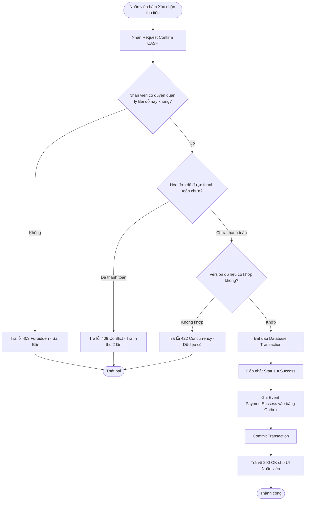
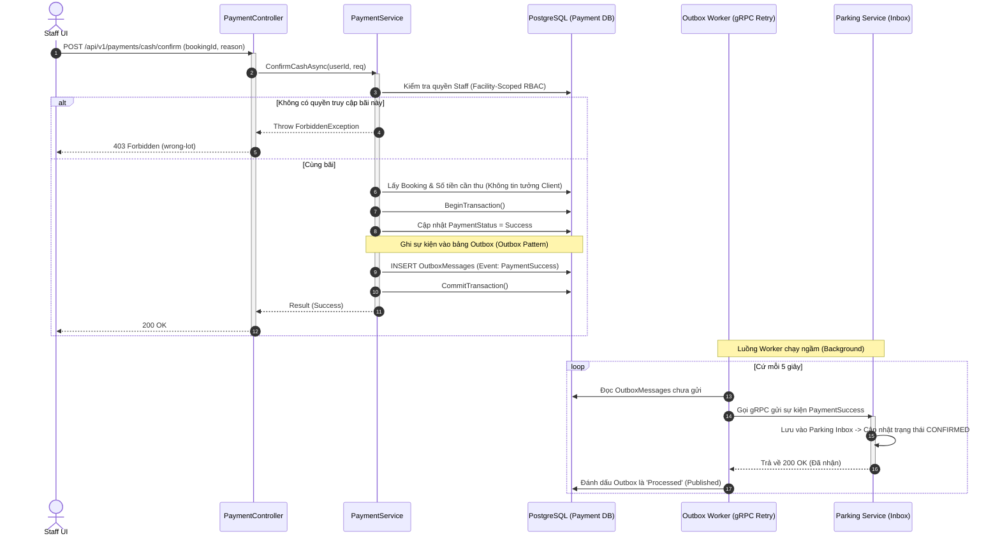

# THIẾT KẾ API: CASH PAYMENT STATUS & CONFIRMATION (SCRUM-50 [S2-06])
- **Owner:** Sơn (TV07)
- **Task:** SCRUM-50 / S2-06
- **Sprint:** SCRUM Sprint 2
- **Trạng thái:** Design Phase (Draft)
---
## 1. Overview (Tổng quan)
Tài liệu này đặc tả các API liên quan đến quy trình thanh toán bằng tiền mặt (CASH) tại quầy/bãi đỗ:
1. **API Kiểm tra trạng thái (Lookup):** Cung cấp dữ liệu cho giao diện người dùng (UI) biết hóa đơn đã được thanh toán hay chưa.
2. **API Nhân viên xác nhận (Staff Confirm):** Nhân viên bãi đỗ xe xác nhận đã thu đủ tiền mặt từ khách. Áp dụng Outbox Pattern để đẩy event `PaymentSuccess` an toàn sang hệ thống Parking xử lý.
*(Bảo mật: Phía Client không được phép gửi tham số `amount` (số tiền) khi gọi API Confirm để ngăn chặn tấn công thay đổi số tiền. Backend tự đọc số tiền từ Database).*
---
## 2. API 1: Kiểm tra trạng thái thanh toán (Lookup Payment Status)
- **Method:** `GET`
- **URL Endpoint:** `/api/v1/payments/{bookingId}/status`
- **Permission:** Customer (Owner của Booking) hoặc Staff (Cùng Lot).
### 2.1. Request & Response Sample
**URL Mẫu:** `/api/v1/payments/c9a01234-5678.../status`
**Khung phản hồi (200 OK):**
```json
{
  "result": {
    "bookingId": "c9a01234-5678-90ab-cdef-1234567890ab",
    "paymentMethod": "CASH",
    "paymentStatus": "Pending",
    "totalAmount": 45000,
    "currency": "VND",
    "lastUpdatedAt": "2026-10-07T09:10:00Z"
  },
  "isSuccess": true,
  "statusCode": 200,
  "message": "Retrieved payment status successfully."
}
```
## 3.API 2: Staff Xác nhận Thu Tiền Mặt (Confirm CASH)
- **Method:** `POST`
- **URL Endpoint:** `/api/v1/payments/cash/confirm`
- **Permission:** `PARKING_STAFF` hoặc `PARKING_MANAGER` (Kèm Facility-Scoped RBAC).
### 3.1. Request Sample
``` json
{
  "bookingId": "c9a01234-5678-90ab-cdef-1234567890ab",
  "staffReason": "Khách thanh toán bằng tiền mặt tại cổng OUT",
  "version": 1
}
```
### 3.2. Response Sample
```json
{
  "result": {
    "paymentId": "pay-8899aabb",
    "status": "Success",
    "confirmedBy": "staff_01",
    "confirmedAt": "2026-10-07T10:15:22Z"
  },
  "isSuccess": true,
  "statusCode": 200,
  "message": "CASH payment confirmed. Receipt is being generated."
}
```
## 4. Validation & Error Handling (Xử lý Lỗi & Mã Lỗi)
| Status Code | Message / Nguyên nhân |
| :---: | :--- |
| **403** | `Forbidden. Staff does not have access to this parking lot.` (Nhân viên xác nhận nhầm bãi xe của người khác - wrong-lot 403). |
| **409** | `Payment already confirmed.` (Tránh duplicate request/event thu tiền 2 lần). |
| **422** | `Concurrency conflict. Please refresh and try again.` (Sai Version). |
## 5. Diagrams (Sơ đồ Thiết kế)
### 5.1. Activity Diagram (Sơ đồ Luồng Hoạt động Staff Confirm)

### 5.2. Sequence Diagram (Luồng Staff Confirm CASH & Outbox Pattern)


