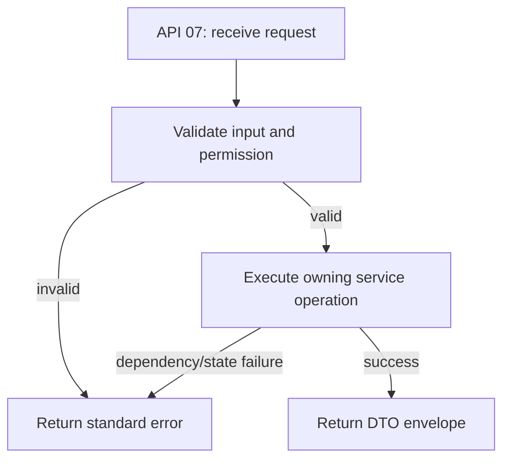

# REST contract runtime — Microservices amendment

Gateway base: `http://localhost:8080`. Samples are synthetic; use future times and seeded data matching the deployment. Health endpoints use the same envelope. All REST endpoints below have actual mappings; business workflows not listed are not exposed.

Header protected endpoints: `Authorization: Bearer <accessToken>`. Writes noted idempotent require `Idempotency-Key`. Error format: `{"result":null,"isSuccess":false,"statusCode":403,"message":"Access denied"}`. Shared errors:400 input,401 auth,403 permission,404 lookup after scope where applicable,409 state/version/key/constraint,429 Gateway limit,503 dependency/provider. Never expose exception/SQL/JWT/PII in errors.

## API-01 — GET `/health/live`

Owner: **Each host**. Permission: **Anonymous**.

### Request

```json
{}
```

GET body above is empty; query/path parameters are specified in the URL.

### Response sample

```json
{
  "result": {
    "service": "parking",
    "status": "live"
  },
  "isSuccess": true,
  "statusCode": 200,
  "message": "Success"
}
```

### Validation and failure

Process liveness, not provider/business readiness.

### Activity


### Sequence

```mermaid
sequenceDiagram
    participant Client
    participant Gateway
    participant Service
    participant OwnedDependency
    Client->>Gateway: GET API-01
    Gateway->>Service: Route request; forward JWT
    Service->>Service: Validate current permission and input
    Service->>OwnedDependency: Owned database operation or versioned gRPC call
    OwnedDependency-->>Service: Result or failure
    Service-->>Gateway: DTO envelope / error
    Gateway-->>Client: HTTP response
```

## API-02 — GET `/health/ready`

Owner: **Each host / Gateway**. Permission: **Anonymous**.

### Request

```json
{}
```

GET body above is empty; query/path parameters are specified in the URL.

### Response sample

```json
{
  "result": {
    "service": "parking",
    "status": "ready",
    "schemaVersion": 1
  },
  "isSuccess": true,
  "statusCode": 200,
  "message": "Success"
}
```

### Validation and failure

503 when DB/schema unavailable. Gateway checks all 4 schema-readiness endpoints. OCR adapter/evaluation is a separate capability, not implied ready.

### Activity


### Sequence

```mermaid
sequenceDiagram
    participant Client
    participant Gateway
    participant Service
    participant OwnedDependency
    Client->>Gateway: GET API-02
    Gateway->>Service: Route request; forward JWT
    Service->>Service: Validate current permission and input
    Service->>OwnedDependency: Owned database operation or versioned gRPC call
    OwnedDependency-->>Service: Result or failure
    Service-->>Gateway: DTO envelope / error
    Gateway-->>Client: HTTP response
```

## API-03 — POST `/api/v1/auth/register`

Owner: **Identity**. Permission: **Anonymous**.

### Request

```json
{
  "email": "customer@example.test",
  "password": "Example-test-password-123",
  "fullName": "TV customer"
}
```

Request field types follow JSON: UUID strings, UTC ISO8601 instants, booleans and numbers. Required fields are those shown except explicitly null/optional values. Unknown privileged fields never grant roles or amounts.

### Response sample

```json
{
  "result": {
    "userId": "11111111-1111-4111-8111-111111111111"
  },
  "isSuccess": true,
  "statusCode": 200,
  "message": "Success"
}
```

### Validation and failure

10–128 password characters; normalized unique email; role fixed CUSTOMER; duplicate 409; rate protection at Gateway.

### Activity


### Sequence

```mermaid
sequenceDiagram
    participant Client
    participant Gateway
    participant Service
    participant OwnedDependency
    Client->>Gateway: POST API-03
    Gateway->>Service: Route request; forward JWT
    Service->>Service: Validate current permission and input
    Service->>OwnedDependency: Owned database operation or versioned gRPC call
    OwnedDependency-->>Service: Result or failure
    Service-->>Gateway: DTO envelope / error
    Gateway-->>Client: HTTP response
```

## API-04 — POST `/api/v1/auth/login`

Owner: **Identity**. Permission: **Anonymous**.

### Request

```json
{
  "email": "customer@example.test",
  "password": "Example-test-password-123"
}
```

Request field types follow JSON: UUID strings, UTC ISO8601 instants, booleans and numbers. Required fields are those shown except explicitly null/optional values. Unknown privileged fields never grant roles or amounts.

### Response sample

```json
{
  "result": {
    "accessToken": "<JWT>",
    "expiresAt": "2026-10-07T02:15:00Z"
  },
  "isSuccess": true,
  "statusCode": 200,
  "message": "Success"
}
```

### Validation and failure

401 wrong credentials/locked/inactive; 15 minute token; no refresh/recovery workflow yet.

### Activity


### Sequence

```mermaid
sequenceDiagram
    participant Client
    participant Gateway
    participant Service
    participant OwnedDependency
    Client->>Gateway: POST API-04
    Gateway->>Service: Route request; forward JWT
    Service->>Service: Validate current permission and input
    Service->>OwnedDependency: Owned database operation or versioned gRPC call
    OwnedDependency-->>Service: Result or failure
    Service-->>Gateway: DTO envelope / error
    Gateway-->>Client: HTTP response
```

## API-05 — POST `/api/v1/staff-assignments`

Owner: **Identity**. Permission: **Current ADMIN**.

### Request

```json
{
  "lotId": "11111111-1111-4111-8111-111111111111",
  "userId": "22222222-2222-4222-8222-222222222222",
  "role": "PARKING_STAFF",
  "activeFrom": "2026-10-07T00:00:00Z",
  "activeTo": null,
  "canManageStaffAssignments": false
}
```

Request field types follow JSON: UUID strings, UTC ISO8601 instants, booleans and numbers. Required fields are those shown except explicitly null/optional values. Unknown privileged fields never grant roles or amounts.

### Response sample

```json
{
  "result": {
    "assignmentId": "11111111-1111-4111-8111-111111111111"
  },
  "isSuccess": true,
  "statusCode": 200,
  "message": "Success"
}
```

### Validation and failure

Parking catalog validates lot by gRPC; user FK local Identity. Role Staff/Manager only. Delegated-manager write APIs are not implemented.

### Activity


### Sequence

```mermaid
sequenceDiagram
    participant Client
    participant Gateway
    participant Service
    participant OwnedDependency
    Client->>Gateway: POST API-05
    Gateway->>Service: Route request; forward JWT
    Service->>Service: Validate current permission and input
    Service->>OwnedDependency: Owned database operation or versioned gRPC call
    OwnedDependency-->>Service: Result or failure
    Service-->>Gateway: DTO envelope / error
    Gateway-->>Client: HTTP response
```

## API-06 — GET `/api/v1/parking-lots`

Owner: **Parking**. Permission: **Anonymous**.

### Request

```json
{}
```

GET body above is empty; query/path parameters are specified in the URL.

### Response sample

```json
{
  "result": [
    {
      "id": "11111111-1111-4111-8111-111111111111",
      "code": "LOT-A",
      "name": "Bãi A",
      "address": "Địa chỉ mẫu",
      "latitude": 10.7,
      "longitude": 106.6,
      "timezone": "Asia/Ho_Chi_Minh"
    }
  ],
  "isSuccess": true,
  "statusCode": 200,
  "message": "Success"
}
```

### Validation and failure

No user/plate/audit PII. Active lots only; no search endpoint in this release.

### Activity


### Sequence

```mermaid
sequenceDiagram
    participant Client
    participant Gateway
    participant Service
    participant OwnedDependency
    Client->>Gateway: GET API-06
    Gateway->>Service: Route request; forward JWT
    Service->>Service: Validate current permission and input
    Service->>OwnedDependency: Owned database operation or versioned gRPC call
    OwnedDependency-->>Service: Result or failure
    Service-->>Gateway: DTO envelope / error
    Gateway-->>Client: HTTP response
```

## API-07 — POST `/api/v1/bookings`

Owner: **Parking**. Permission: **JWT current active user + verified vehicle access**.

### Request

```json
{
  "lotId": "11111111-1111-4111-8111-111111111111",
  "slotId": "33333333-3333-4333-8333-333333333333",
  "vehicleId": "44444444-4444-4444-8444-444444444444",
  "startsAt": "2026-10-07T02:00:00Z",
  "endsAt": "2026-10-07T04:00:00Z"
}
```

Request field types follow JSON: UUID strings, UTC ISO8601 instants, booleans and numbers. Required fields are those shown except explicitly null/optional values. Unknown privileged fields never grant roles or amounts.

### Response sample

```json
{
  "result": {
    "id": "11111111-1111-4111-8111-111111111111",
    "code": "B...",
    "status": "PENDING_PAYMENT",
    "estimatedAmount": 60000,
    "holdExpiresAt": "2026-10-07T01:15:00Z",
    "version": 1
  },
  "isSuccess": true,
  "statusCode": 200,
  "message": "Success"
}
```

### Validation and failure

Idempotency-Key required. EXACT_SLOT only; time/policy/opening/closure/physical occupancy/vehicle compatibility checks, locks + GiST. Only one FLAT_BLOCK price rule supported; other pricing plans fail 409. No QR before verified payment.

### Activity



### Sequence

```mermaid
sequenceDiagram
    participant Client
    participant Gateway
    participant Service
    participant OwnedDependency
    Client->>Gateway: POST API-07
    Gateway->>Service: Route request; forward JWT
    Service->>Service: Validate current permission and input
    Service->>OwnedDependency: Owned database operation or versioned gRPC call
    OwnedDependency-->>Service: Result or failure
    Service-->>Gateway: DTO envelope / error
    Gateway-->>Client: HTTP response
```

## API-08 — POST `/api/v1/parking-lots/{lotId}/plate-recognitions`

Owner: **Parking → AI**. Permission: **JWT + current lot OCR permission**.

### Request

```json
{
  "imageBase64": "<PNG-or-JPEG-base64>",
  "contentType": "image/png"
}
```

Request field types follow JSON: UUID strings, UTC ISO8601 instants, booleans and numbers. Required fields are those shown except explicitly null/optional values. Unknown privileged fields never grant roles or amounts.

### Response sample

```json
{
  "result": {
    "id": "11111111-1111-4111-8111-111111111111",
    "status": "PENDING_REVIEW",
    "candidatePlate": "51A12345",
    "confidence": 0.95,
    "modelVersion": "<configured-provider>"
  },
  "isSuccess": true,
  "statusCode": 200,
  "message": "Success"
}
```

### Validation and failure

Idempotency-Key <=128, image <=4 MiB with signature validation. 401 no token,403 wrong scope,400 bad image,409 changed payload/key,503 no/failing provider. No automatic gate/financial action.

### Activity


### Sequence

```mermaid
sequenceDiagram
    participant Client
    participant Gateway
    participant Service
    participant OwnedDependency
    Client->>Gateway: POST API-08
    Gateway->>Service: Route request; forward JWT
    Service->>Service: Validate current permission and input
    Service->>OwnedDependency: Owned database operation or versioned gRPC call
    OwnedDependency-->>Service: Result or failure
    Service-->>Gateway: DTO envelope / error
    Gateway-->>Client: HTTP response
```

## API-09 — POST `/api/v1/payments`

Owner: **Payment → Parking quote**. Permission: **JWT + booking owner or current assigned Staff**.

### Request

```json
{
  "bookingId": "11111111-1111-4111-8111-111111111111",
  "method": "CASH"
}
```

Request field types follow JSON: UUID strings, UTC ISO8601 instants, booleans and numbers. Required fields are those shown except explicitly null/optional values. Unknown privileged fields never grant roles or amounts.

### Response sample

```json
{
  "result": {
    "id": "11111111-1111-4111-8111-111111111111",
    "lotId": "11111111-1111-4111-8111-111111111111",
    "bookingId": "11111111-1111-4111-8111-111111111111",
    "amount": 60000,
    "currency": "VND",
    "method": "CASH",
    "status": "PENDING",
    "version": 1
  },
  "isSuccess": true,
  "statusCode": 200,
  "message": "Success"
}
```

### Validation and failure

Idempotency-Key required, amount from Parking only. VNPAY returns 503 until verified adapter is implemented. Booking currently payable and hold valid for a new request.

### Activity


### Sequence

```mermaid
sequenceDiagram
    participant Client
    participant Gateway
    participant Service
    participant OwnedDependency
    Client->>Gateway: POST API-09
    Gateway->>Service: Route request; forward JWT
    Service->>Service: Validate current permission and input
    Service->>OwnedDependency: Owned database operation or versioned gRPC call
    OwnedDependency-->>Service: Result or failure
    Service-->>Gateway: DTO envelope / error
    Gateway-->>Client: HTTP response
```

## API-10 — POST `/api/v1/parking-lots/{lotId}/payments/{paymentId}/cash-confirmation`

Owner: **Payment**. Permission: **JWT + current assigned PARKING_STAFF CASH permission**.

### Request

```json
{
  "version": 1,
  "reason": "Đã nhận tiền mặt và đối chiếu booking"
}
```

Request field types follow JSON: UUID strings, UTC ISO8601 instants, booleans and numbers. Required fields are those shown except explicitly null/optional values. Unknown privileged fields never grant roles or amounts.

### Response sample

```json
{
  "result": {
    "id": "11111111-1111-4111-8111-111111111111",
    "lotId": "11111111-1111-4111-8111-111111111111",
    "bookingId": "11111111-1111-4111-8111-111111111111",
    "amount": 60000,
    "currency": "VND",
    "method": "CASH",
    "status": "SUCCESS",
    "version": 2
  },
  "isSuccess": true,
  "statusCode": 200,
  "message": "Success"
}
```

### Validation and failure

Actor server-derived; 403 Customer/Manager without Staff assignment,409 wrong version/state. Successful receipt and outbox atomic. Repeated SUCCESS confirmation returns existing result, no new event. Not physical exit.

### Activity


### Sequence

```mermaid
sequenceDiagram
    participant Client
    participant Gateway
    participant Service
    participant OwnedDependency
    Client->>Gateway: POST API-10
    Gateway->>Service: Route request; forward JWT
    Service->>Service: Validate current permission and input
    Service->>OwnedDependency: Owned database operation or versioned gRPC call
    OwnedDependency-->>Service: Result or failure
    Service-->>Gateway: DTO envelope / error
    Gateway-->>Client: HTTP response
```

## API-11 — GET `/api/v1/parking-lots/{lotId}/occupancy-forecasts?vehicleType=CAR&horizonMinutes=30`

Owner: **AI**. Permission: **Anonymous**.

### Request

```json
{}
```

GET body above is empty; query/path parameters are specified in the URL.

### Response sample

```json
{
  "result": {
    "lotId": "11111111-1111-4111-8111-111111111111",
    "predictedOccupied": 12,
    "usableCapacity": 30,
    "modelVersion": "rolling-mean-v1",
    "dataSource": "ACTUAL",
    "isAdvisory": true,
    "evaluationStatus": "NOT_EVALUATED"
  },
  "isSuccess": true,
  "statusCode": 200,
  "message": "Success"
}
```

### Validation and failure

Horizon 30/60/120 only; at least 2 fresh ACTUAL snapshots, latest <=10min and capacity>0; otherwise503. Statistical baseline, not trained/evaluated model.

### Activity

```mermaid
flowchart TD
    A[API 11: receive request] --> B[Validate input and permission]
    B -->|invalid| E[Return standard error]
    B -->|valid| C[Execute owning service operation]
    C -->|dependency/state failure| E
    C -->|success| D[Return DTO envelope]
```

### Sequence

```mermaid
sequenceDiagram
    participant Client
    participant Gateway
    participant Service
    participant OwnedDependency
    Client->>Gateway: GET API-11
    Gateway->>Service: Route request; forward JWT
    Service->>Service: Validate current permission and input
    Service->>OwnedDependency: Owned database operation or versioned gRPC call
    OwnedDependency-->>Service: Result or failure
    Service-->>Gateway: DTO envelope / error
    Gateway-->>Client: HTTP response
```

## API-12 — POST `/api/v1/parking-lots/{lotId}/assistant`

Owner: **AI**. Permission: **Anonymous**.

### Request

```json
{
  "question": "Thanh toán rồi thì xe ra như thế nào?"
}
```

Request field types follow JSON: UUID strings, UTC ISO8601 instants, booleans and numbers. Required fields are those shown except explicitly null/optional values. Unknown privileged fields never grant roles or amounts.

### Response sample

```json
{
  "result": {
    "mode": "RETRIEVAL_NO_LLM",
    "answers": [
      {
        "documentId": "11111111-1111-4111-8111-111111111111",
        "revision": 1,
        "title": "Xe ra",
        "section": "Xe ra",
        "content": "Nhân viên xác nhận xe rời bãi.",
        "source": "Approved FAQ"
      }
    ],
    "message": "Nội dung từ hướng dẫn công khai đã duyệt; không thực hiện giao dịch."
  },
  "isSuccess": true,
  "statusCode": 200,
  "message": "Success"
}
```

### Validation and failure

Question <=1000 chars; retrieves up to3 published PUBLIC approved/effective Vietnamese chunks. No LLM, tools, stored chat or business mutation. Empty source has explicit Staff fallback.

### Activity

```mermaid
flowchart TD
    A[API 12: receive request] --> B[Validate input and permission]
    B -->|invalid| E[Return standard error]
    B -->|valid| C[Execute owning service operation]
    C -->|dependency/state failure| E
    C -->|success| D[Return DTO envelope]
```

### Sequence

```mermaid
sequenceDiagram
    participant Client
    participant Gateway
    participant Service
    participant OwnedDependency
    Client->>Gateway: POST API-12
    Gateway->>Service: Route request; forward JWT
    Service->>Service: Validate current permission and input
    Service->>OwnedDependency: Owned database operation or versioned gRPC call
    OwnedDependency-->>Service: Result or failure
    Service-->>Gateway: DTO envelope / error
    Gateway-->>Client: HTTP response
```

## API-13 — POST `/api/v1/ai/documents`

Owner: **AI**. Permission: **JWT + current ADMIN**.

### Request

```json
{
  "lotId": "11111111-1111-4111-8111-111111111111",
  "documentKey": "exit-guide",
  "revision": 1,
  "title": "Xe ra",
  "sourceReference": "Approved team guide",
  "effectiveFrom": "2026-10-07T00:00:00Z",
  "effectiveUntil": null,
  "content": "Nhân viên xác nhận xe rời bãi."
}
```

Request field types follow JSON: UUID strings, UTC ISO8601 instants, booleans and numbers. Required fields are those shown except explicitly null/optional values. Unknown privileged fields never grant roles or amounts.

### Response sample

```json
{
  "result": {
    "id": "11111111-1111-4111-8111-111111111111"
  },
  "isSuccess": true,
  "statusCode": 200,
  "message": "Success"
}
```

### Validation and failure

Creates DRAFT only. Content must be reviewed for public suitability before publishing; not automatic PII sanitization.

### Activity

```mermaid
flowchart TD
    A[API 13: receive request] --> B[Validate input and permission]
    B -->|invalid| E[Return standard error]
    B -->|valid| C[Execute owning service operation]
    C -->|dependency/state failure| E
    C -->|success| D[Return DTO envelope]
```

### Sequence

```mermaid
sequenceDiagram
    participant Client
    participant Gateway
    participant Service
    participant OwnedDependency
    Client->>Gateway: POST API-13
    Gateway->>Service: Route request; forward JWT
    Service->>Service: Validate current permission and input
    Service->>OwnedDependency: Owned database operation or versioned gRPC call
    OwnedDependency-->>Service: Result or failure
    Service-->>Gateway: DTO envelope / error
    Gateway-->>Client: HTTP response
```

## API-14 — POST `/api/v1/ai/documents/{id}/publish`

Owner: **AI**. Permission: **JWT + current ADMIN**.

### Request

```json
{
  "version": 1,
  "confirmPublicContentReviewed": true
}
```

Request field types follow JSON: UUID strings, UTC ISO8601 instants, booleans and numbers. Required fields are those shown except explicitly null/optional values. Unknown privileged fields never grant roles or amounts.

### Response sample

```json
{
  "result": {
    "id": "11111111-1111-4111-8111-111111111111",
    "status": "PUBLISHED"
  },
  "isSuccess": true,
  "statusCode": 200,
  "message": "Success"
}
```

### Validation and failure

Explicit human confirmation, optimistic version, server approver/time;409 stale/wrong state. No public content automatically published.

### Activity

```mermaid
flowchart TD
    A[API 14: receive request] --> B[Validate input and permission]
    B -->|invalid| E[Return standard error]
    B -->|valid| C[Execute owning service operation]
    C -->|dependency/state failure| E
    C -->|success| D[Return DTO envelope]
```

### Sequence

```mermaid
sequenceDiagram
    participant Client
    participant Gateway
    participant Service
    participant OwnedDependency
    Client->>Gateway: POST API-14
    Gateway->>Service: Route request; forward JWT
    Service->>Service: Validate current permission and input
    Service->>OwnedDependency: Owned database operation or versioned gRPC call
    OwnedDependency-->>Service: Result or failure
    Service-->>Gateway: DTO envelope / error
    Gateway-->>Client: HTTP response
```

## API-15 — POST `/api/v1/parking-lots/{lotId}/plate-recognitions/{id}/review`

Owner: **AI**. Permission: **JWT + current lot OCR permission**.

### Request

```json
{
  "plate": "51A12345",
  "version": 2,
  "reason": "Đã đối chiếu ảnh và xe"
}
```

Request field types follow JSON: UUID strings, UTC ISO8601 instants, booleans and numbers. Required fields are those shown except explicitly null/optional values. Unknown privileged fields never grant roles or amounts.

### Response sample

```json
{
  "result": {
    "id": "11111111-1111-4111-8111-111111111111",
    "status": "REVIEWED"
  },
  "isSuccess": true,
  "statusCode": 200,
  "message": "Success"
}
```

### Validation and failure

Normalized A-Z0-9 <=20, version,reason; record same lot, PENDING_REVIEW and unexpired; audit atomic. Does not consume recognition or check in.

### Activity

```mermaid
flowchart TD
    A[API 15: receive request] --> B[Validate input and permission]
    B -->|invalid| E[Return standard error]
    B -->|valid| C[Execute owning service operation]
    C -->|dependency/state failure| E
    C -->|success| D[Return DTO envelope]
```

### Sequence

```mermaid
sequenceDiagram
    participant Client
    participant Gateway
    participant Service
    participant OwnedDependency
    Client->>Gateway: POST API-15
    Gateway->>Service: Route request; forward JWT
    Service->>Service: Validate current permission and input
    Service->>OwnedDependency: Owned database operation or versioned gRPC call
    OwnedDependency-->>Service: Result or failure
    Service-->>Gateway: DTO envelope / error
    Gateway-->>Client: HTTP response
```

## Internal gRPC v1

| RPC | Caller → owner | Deadline / semantics |
|---|---|---|
| FacilityAuthorization.CheckAccess | Parking/Payment/AI → Identity | 3s; user active and current [from,to) assignment; unknown capability deny |
| ParkingCatalog.LotExists | Identity → Parking | 3s; validate active lot before assignment |
| PlateRecognition.Recognize | Parking → AI | 12s; bounded bytes/key; provider timeout10s; no booking lock while waiting |
| OccupancyIngestion.RecordSnapshot | Parking worker → AI | 5s; actual aggregate counts, no PII; interval60s |
| BookingPaymentQuery.GetQuote | Payment → Parking | 5s; owner/assigned Staff; server amount; no cross-DB query |
| ParkingPaymentEvents.DeliverPaymentSucceeded | Payment outbox → Parking inbox | 5s; event ID/payload hash; at-least-once; ACK only after transaction commit |

Protobuf source: `src/Contracts/Parking.Contracts/Protos/v1`. Additive fields only; never reuse removed field numbers. Internal `x-service-key` comes from ignored secrets and is required by interceptor. Key must never be sent to browser. TLS/mTLS and per-caller keys are mandatory before external/production deployment.

```mermaid
sequenceDiagram
    participant Staff
    participant Payment
    participant PaymentDB
    participant Worker
    participant Parking
    participant ParkingDB
    Staff->>Payment: Confirm Cash (JWT, lot, version, reason)
    Payment->>PaymentDB: BEGIN: Success + outbox + audit
    PaymentDB-->>Payment: COMMIT
    Worker->>PaymentDB: Claim pending outbox
    Worker->>Parking: gRPC PaymentSucceeded.v1
    Parking->>ParkingDB: BEGIN: inbox/receipt + locks + reservation recheck
    ParkingDB-->>Parking: COMMIT outcome
    Parking-->>Worker: ACK outcome
    Worker->>PaymentDB: Mark delivered after ACK
```

No callback endpoint accepts an unsigned/manual success as VNPay. Cash is a separate real operation requiring assigned Staff confirmation. QR/check-in/check-out/physical-exit APIs remain on the implementation backlog and must preserve core database guards.
