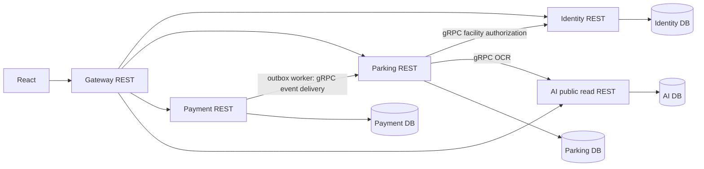

# Microservices amendment — 06/10/2026

Theo yêu cầu mentor do người dùng xác nhận, thay định hướng monolith cho phần backend mới. Các bất biến multi-lot, envelope, facility RBAC, transaction/locks/GiST và physical exit vẫn giữ nguyên. Đây là amendment; tài liệu baseline cũ không phải bằng chứng runtime mới.

## Ranh giới triển khai

| Service | Dữ liệu và trách nhiệm | Owner |
|---|---|---|
| Identity | users, credentials, tokens, platform roles, facility assignments; kiểm tra user hiện tại/assignment | TV5 |
| Parking | lots, levels/zones/slots, vehicles/access, booking/reservations/QR/sessions, pricing snapshots, physical exit, maps/operations | TV6 + TV7 giá; TV8 map |
| Payment | visit billing account/ledger, payments/attempts/refunds/provider webhook events | TV7 |
| AI | OCR/review, occupancy snapshots/forecasts, public approved document/chunks | TV8 điều phối, cần phân công provider |
| Gateway | route REST tới đúng service; không sở hữu bảng nghiệp vụ | TV8 |

Booking, session và slot không tách thành các service khác nhau. GiST guards và advisory locks ở Parking DB. Identity sở hữu assignment theo lot_id ngoại bộ; lot không trở thành Identity aggregate. Mỗi service sở hữu database và migration riêng. Shared code chỉ chứa envelope, transport, technical infrastructure và hợp đồng versioned; không chứa domain entity/repository dùng chung.



## Giao tiếp và lỗi

- REST dùng envelope chuẩn, 401/403 cho authorization, 409 cho state/version/policy, 503 cho dependency/provider chưa sẵn sàng. gRPC dùng protobuf/status, không nhét HTTP envelope vào wire format.
- gRPC có deadline/cancellation; không gọi provider khi đang giữ booking/slot transaction locks. Channel được tái dùng qua DI.
- Payment state + outbox ghi trong cùng transaction. Worker gửi event gRPC sau commit; chỉ đánh dấu delivered sau ACK. Parking inbox insert event_id + update business state cùng transaction. At-least-once + consumer idempotency, không tuyên bố distributed exactly-once.
- Một payment event có tiền nhưng hold đã hết không Confirmed. Ghi reconciliation outcome và không ghi đè reservation khách khác.
- Không cần broker cho luồng đầu tiên: outbox → gRPC → inbox là transport async bền vững. Có thể thay delivery bằng RabbitMQ sau mà giữ event version/idempotency. Không dùng gọi gRPC trực tiếp trong callback thay cho durable outbox.
- JWT xác thực ở service đích, không chỉ Gateway. Identity kiểm tra account active và assignment còn hiệu lực khi authorization. Internal gRPC không mở ra frontend. Local isolated development có service key; production phải cấu hình TLS/mTLS/secret rotation trước deployment.

## Database

`database/Parking_Database_V4.sql` là bản schema monolith tham khảo. Dùng `database/services/<service>/001_schema.sql` cho triển khai mới. Ownership manifest ghi đủ 47 bảng gốc, các FK xuyên service được loại bỏ có ghi inventory; không drop bất kỳ dữ liệu đã triển khai.

Audit/outbox/inbox là local technical data từng service. Không coi bộ 47 bảng gốc là giới hạn số bảng sau phân tách. Mỗi owner lưu actor/lot ID ngoại bộ và snapshot cần thiết; không truy vấn database của owner khác.

## Cấu trúc đích

```text
src/
  Gateway/Parking.Gateway/
  BuildingBlocks/Parking.ServiceDefaults/
  Contracts/Parking.Contracts/Protos/v1/
  Services/{Identity,Parking,Payment,AI}/
    Parking.<Service>.{Domain,Application,Infrastructure,Api}/
tests/
database/services/{identity,parking,payment,ai}/
deploy/docker/
scripts/microservices/
docs/microservices/
legacy/backend-template/
```

Template MyStore/SQL Server giữ ở legacy để tham khảo, không chuyển AccountMember chứa mật khẩu sang Identity hay chạy cùng compose mới. Không copy plaintext passwords vào schema mới.

## Phạm vi kiểm chứng

Không đánh dấu module nghiệp vụ hoàn thành chỉ vì project build được. README/runbook và bảng IMPLEMENTATION-STATUS phải ghi rõ endpoint runtime, provider chưa cấu hình, policy cần duyệt và test đã chạy. Các hợp đồng API mới có samples + activity/sequence diagrams riêng.
