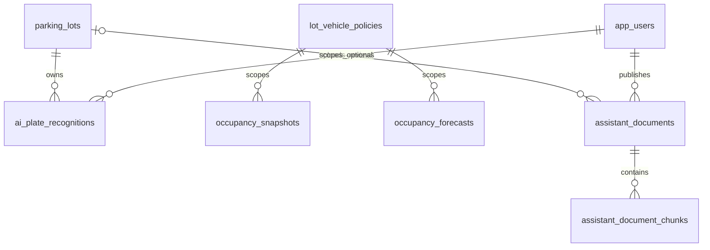
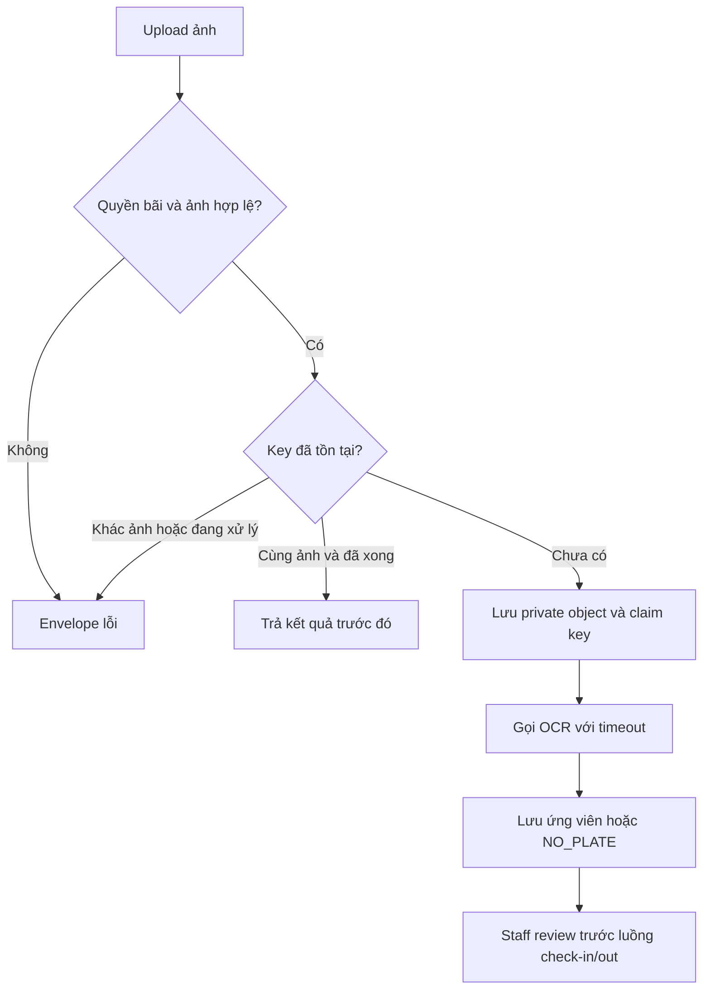
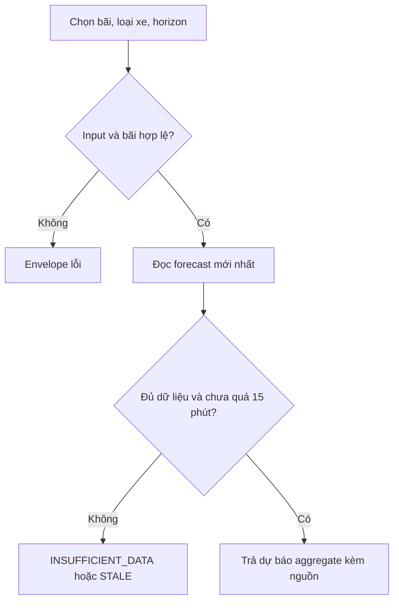
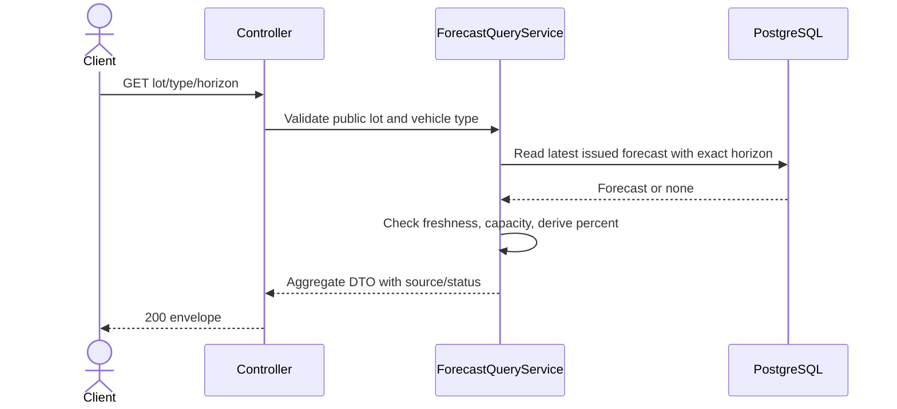
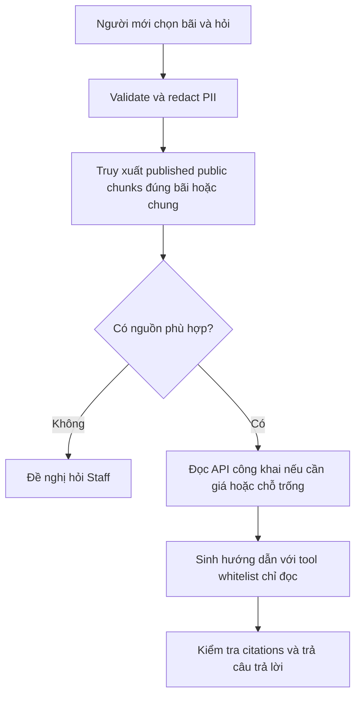

# AI Extension — Baseline V4.1 của nhóm

Ngày cập nhật: 2026-10-03. Đây là phạm vi nhóm lựa chọn theo yêu cầu bổ sung, không phải yêu cầu mới đã được Mentor phê duyệt. Core Baseline V4 vẫn là điều kiện demo end-to-end.

## 1. Phạm vi và ranh giới

| ID | Chức năng | MVP của nhóm |
|---|---|---|
| FR-AI-01 | Nhận diện biển số từ ảnh tải lên | Staff tại bãi được gán tải ảnh; AI trả biển số ứng viên và confidence; Staff kiểm tra/sửa trước khi dùng nghiệp vụ check-in/out. |
| FR-AI-02 | Dự đoán mức đầy bãi | Dự báo riêng từng bãi/loại xe tại các mốc 30, 60, 120 phút từ thời điểm phát hành dự báo. |
| FR-AI-03 | Trợ lý hướng dẫn người mới | Hướng dẫn vào đúng cổng, dùng QR, tìm tầng/khu/slot trên bản đồ, thanh toán và ra bãi; trả lời dựa trên tài liệu đã duyệt và API hiện tại. |

Khách vẫn có thể dùng QR và hỏi Staff khi AI lỗi. Camera trực tiếp, điều khiển barrier tự động bằng AI, huấn luyện mô hình thị giác từ đầu, định giá động bằng AI và chatbot production-scale nằm ngoài MVP. Huấn luyện mô hình dự báo nhỏ trên lịch sử công suất nằm trong phạm vi FR-AI-02.

### 1.1. Luồng sử dụng

- Biển số: Staff chọn bãi → upload ảnh → đọc ứng viên → xác nhận/sửa tại luồng check-in hiện có → backend kiểm tra đúng bãi, booking, xe, phiên đỗ và quyền → transaction/advisory lock → ghi AuditLog. Không suy ra quyền sở hữu xe từ ảnh/biển số. Kết quả OCR không tự tạo session hay mở barrier. Nếu check-out, vẫn phải thỏa chính sách thanh toán và có xác nhận xe rời bãi.
- Dự báo: worker ghi snapshot mỗi 15 phút → mô hình dùng dữ liệu quá khứ và booking đã biết tại thời điểm phát hành → lưu kết quả → dashboard hiển thị dự báo và thời gian tạo. Dự báo không phải số chỗ có thể đặt; availability vẫn lấy từ nghiệp vụ database.
- Trợ lý: khách chọn bãi → hỏi “lần đầu vào bãi thì làm gì?” → truy xuất hướng dẫn công khai đúng bãi và hướng dẫn chung → trả lời từng bước kèm nguồn. Giá/chỗ trống phải gọi dịch vụ hiện tại qua backend; nếu API lỗi thì nói chưa lấy được dữ liệu, không tự đoán. Chỉ dẫn đường đi theo tài liệu/bản đồ đã công bố; không cam kết route nội bộ tối ưu khi chưa có navigation graph.

### 1.2. Quy tắc dữ liệu và an toàn nghiệp vụ

1. Không trả ảnh gốc, biển số đầy đủ, số điện thoại hay AuditLog qua endpoint công khai. API OCR chỉ dành cho Staff/Manager được gán hoặc Admin; kết quả đầy đủ chỉ xuất hiện trong giao diện vận hành có quyền.
2. Ảnh lưu trong object/file storage riêng tư, database chỉ lưu object key; không lưu base64, public URL hoặc signed URL dài hạn. Kiểm tra nội dung thật JPEG/PNG, giới hạn 5 MiB và số pixel cấu hình (mặc định 20 megapixel); bỏ EXIF, không cho backend tải URL tùy ý do client cung cấp.
3. Confidence nằm trong [0,1], không phải cam kết chính xác. Threshold cấu hình riêng từng bãi; mọi kết quả MVP vẫn cần Staff xác nhận. Ảnh không đọc được trả `NO_PLATE`, không tạo biển số giả.
4. Xác nhận/sửa biển số phải kiểm tra lại quyền, cùng bãi, thời hạn kết quả, trạng thái `PENDING_REVIEW`; ghi người xác nhận và AuditLog trong transaction của nghiệp vụ. Dùng kết quả một lần bằng khóa dòng/optimistic concurrency, không để hai request tạo hai session.
5. Chatbot chỉ đọc dữ liệu công khai trong MVP, kể cả người hỏi đã đăng nhập. Không truy vấn booking/session cá nhân, không đặt chỗ, thu tiền, đổi trạng thái slot hoặc phạt khách. Nội dung chat/tài liệu được xem là dữ liệu, không được thay đổi quyền hay tool whitelist của backend.
6. Không lưu lịch sử chat mặc định; session ngắn hạn chỉ ở client. Redact PII trước khi gọi dịch vụ AI và không ghi câu hỏi nguyên văn vào log. Bí mật/API key nằm ở backend qua biến môi trường hoặc User Secrets.
7. Chính sách mặc định đề xuất: ảnh và kết quả OCR tối đa 24 giờ; snapshots/forecasts tối đa 180 ngày. Worker xóa cả object và bản ghi hết hạn, retry khi storage lỗi; không xóa AuditLog. Audit chỉ lưu ID kết quả, actor và lý do, tránh sao chép ảnh/biển số. Các thời hạn là cấu hình nhóm, cần công bố mục đích và thời gian lưu trước triển khai thực tế.
8. Tài liệu hướng dẫn chỉ được truy xuất khi `PUBLISHED`, `PUBLIC`, còn hiệu lực và đúng bãi hoặc tài liệu chung. Thay đổi nội dung phải tạo revision mới/chunks mới và duyệt trước xuất bản; không dùng draft trong câu trả lời.

## 2. Database và ánh xạ tên

Giữ nguyên Booking, ParkingSession, Payment, SlotReservation và các GiST guards. Bổ sung 5 bảng:

| Bảng DBML/SQL V4 | Tên logic trong docs/.NET | Mục đích |
|---|---|---|
| `ai_plate_recognitions` | PlateRecognition | Ảnh private, ứng viên OCR, model version, confidence, trạng thái review, Staff xử lý, hạn lưu. |
| `occupancy_snapshots` | OccupancySnapshot | Công suất vật lý theo bãi/loại xe tại một thời điểm, capacity có hiệu lực, nguồn dữ liệu. |
| `occupancy_forecasts` | OccupancyForecast | Dự báo có thời điểm phát hành, mốc dự báo, capacity, số xe dự kiến, khoảng dự báo và model version. |
| `assistant_documents` | AssistantDocument | Hướng dẫn chung/theo bãi, revision, trạng thái duyệt, thời gian hiệu lực, nguồn tham khảo. |
| `assistant_document_chunks` | AssistantDocumentChunk | Các đoạn nội dung của revision để truy xuất, thứ tự đoạn và nguồn trích dẫn. |

Không cần bảng chat để chatbot hoạt động. Không bắt buộc pgvector trong MVP; tìm đoạn theo từ khóa trước, có thể thêm embedding khi đã chọn model/dimension. API key không nằm trong `app_settings`. Cấu hình không bí mật có thể lưu tại `app_settings` hiện có: feature flags, threshold theo bãi, upload/timeout limits, retention, lịch snapshot và giới hạn truy vấn chatbot.

ERD bổ sung:



File đầy đủ: [DBML V4](Parking_Database_V4.dbml). Bản này mở rộng 42 bảng của `database-v3` thành 47 bảng, giữ nguyên core V3. V3 là thiết kế, chưa phải schema đã chạy. [SQL bổ sung](001_ai_extension.sql) chỉ áp dụng cho core V3 **snake_case** đã được tạo trong schema `public`; không tương thích trực tiếp với DbContext dùng bảng PascalCase hay prototype cũ. SQL không tạo core và không được tự chạy lên database đang dùng. Việc map entity/EF migration và nối API là implementation riêng sau bước design này.

### 2.1. Định nghĩa công suất và kiểm chứng dự báo

- `usable_capacity`: số slot ACTIVE tương thích loại xe tại thời điểm snapshot; loại MAINTENANCE/DISABLED. Slot dùng được cho nhiều loại xe có thể xuất hiện trong nhiều nhóm: không cộng tổng các nhóm để tính công suất toàn bãi.
- `occupied_count`: số slot vật lý có xe thuộc loại đó qua assignment/session đang hoạt động đã xác minh, đếm distinct slot; không đếm booking tương lai. Nếu dữ liệu không nhất quán hoặc chưa xác minh thì không phát snapshot `ACTUAL` hợp lệ, báo vận hành xử lý.
- `reserved_count`: số distinct slot có reservation hiệu lực tại thời điểm snapshot và chưa được tính occupied; không biến con số này thành xe vật lý. Lot-only/unassigned booking được tính là feature riêng trong quá trình dự báo, không giả tạo occupied slot.
- Tỷ lệ đầy vật lý = occupied / usable_capacity × 100; capacity bằng 0 trả tỷ lệ null và trạng thái không đủ điều kiện dự báo.
- Forecast có `generated_at`, `target_at`, `data_cutoff_at`, capacity giả định tại target, nguồn ACTUAL/SIMULATED và phiên bản mô hình. Chỉ trả các mốc cách generated_at 30/60/120 phút; nếu capacity target bằng 0, thiếu lịch sử hoặc forecast quá 15 phút thì trả `INSUFFICIENT_DATA`/`STALE` và không quảng bá như dự báo mới.
- Không lưu tỷ lệ suy diễn để tránh lệch giữa count và capacity. Khoảng lower/upper là prediction interval được hiệu chỉnh trên validation, không gọi là “confidence 95%” nếu chưa kiểm chứng coverage.
- Baseline so sánh: mức đầy hiện tại và trung bình cùng khung giờ/ngày trong tuần. Mô hình dự báo học từ snapshot, xe vào/ra tổng hợp và booking đã biết; không dùng biển số/số điện thoại làm feature. Model chỉ được coi là cải thiện khi vượt baseline trên holdout theo thời gian; nếu không vượt thì sử dụng baseline và ghi đúng tên phương pháp.
- Chia train/validation/test theo thời gian, không random split. Feature booking tại thời điểm phát hành chỉ dùng lịch sử đã biết khi đó; không dùng trạng thái được cập nhật về sau để backtest. Báo MAE số xe và MAE điểm phần trăm công suất cho từng horizon/bãi/loại xe, sample count, khoảng thời gian và nguồn dữ liệu. Dữ liệu mô phỏng phải gắn nhãn, không tuyên bố độ chính xác thực tế.

## 3. Thiết kế API (chưa triển khai)

HTTP status phải khớp `statusCode`. Lỗi có ProblemDetails trong `result` và vẫn giữ envelope. Mỗi request có timeout/rate limit cấu hình; provider lỗi không ảnh hưởng API booking/payment.

### 3.1. Upload ảnh nhận diện

**Overview:** đọc biển số để Staff hỗ trợ vào/ra bãi, không thay thế check-in/out.

**Specification:** `POST /api/v1/parking-lots/{lotId}/plate-recognitions`, multipart/form-data. Staff/Manager có assignment hiệu lực đúng bãi hoặc Admin. Header `Idempotency-Key` bắt buộc; dedupe theo `(lotId, uploaderId, key)` sau kiểm tra quyền. Dùng lại key với nội dung ảnh khác trả 409; digest tính trên byte upload trước bước bỏ EXIF.

**Request sample:** `lotId=11111111-1111-4111-8111-111111111111`; form field `image=<binary JPEG/PNG>` duy nhất. Bãi là UUID tồn tại; ảnh bắt buộc, tối đa 5 MiB/20 MP. Key dài 1–128 ký tự. Chưa hỗ trợ upload Guest/Customer trong MVP.

**Response sample (201):**

```json
{"result":{"recognitionId":"22222222-2222-4222-8222-222222222222","candidatePlate":"29A12345","confidence":0.92,"status":"PENDING_REVIEW","requiresStaffReview":true},"isSuccess":true,"statusCode":201,"message":"Vui lòng kiểm tra biển số trước khi check-in/out."}
```

Replay thành công trả 200, không tạo bản ghi mới. Không tìm thấy biển số trả 201 với `candidatePlate=null`, `confidence=null`, `status=NO_PLATE`; provider lỗi trả 503, không giả lập nhận diện thành công. Staff sửa/xác nhận qua luồng check-in/out hiện có với `recognitionId` và biển số đã kiểm tra; contract mở rộng của các endpoint đó phải được thiết kế trước implementation.

**Errors:** 400 thiếu/key sai/ảnh hỏng; 401 chưa đăng nhập; 403 sai bãi; 404 không có bãi; 409 key khác nội dung hoặc đang xử lý; 413 quá dung lượng/pixel; 415 sai định dạng; 429 rate limit; 503 provider timeout/unavailable.



```mermaid
sequenceDiagram
    actor Staff
    participant API as Controller
    participant S as RecognitionService
    participant DB as PostgreSQL
    participant Store as PrivateStorage
    participant AI as OCRProvider
    Staff->>API: multipart image + Idempotency-Key
    API->>S: Validate scope, decode, limits, digest
    S->>DB: Claim unique key after authorization
    S->>Store: Save sanitized image
    S->>AI: Recognize with timeout
    AI-->>S: Candidate/confidence or no plate
    S->>DB: Persist result and expiry
    S-->>API: Review DTO
    API-->>Staff: 201 envelope; no gate action
```

### 3.2. Xem dự báo mức đầy

**Overview:** xem dự báo vật lý để lên kế hoạch, không dùng thay availability.

**Specification:** `GET /api/v1/parking-lots/{lotId}/occupancy-forecast?vehicleType=CAR&horizonMinutes=60`. Public, chỉ trả aggregate cho bãi công khai. `vehicleType` là code hiện có trong `vehicle_types`, không giả định mọi schema dùng code `CAR`.

**Request sample:** URL trên; lotId bắt buộc UUID; vehicleType bắt buộc được hỗ trợ tại bãi; horizonMinutes bắt buộc thuộc 30/60/120. Server chọn forecast mới nhất không được phát hành trong tương lai, có đúng horizon; không nhận target tùy ý.

**Response sample (200):**

```json
{"result":{"status":"READY","generatedAt":"2026-10-03T03:00:00Z","targetAt":"2026-10-03T04:00:00Z","usableCapacity":100,"predictedOccupied":82,"predictedOccupancyPercent":82,"lowerOccupied":74,"upperOccupied":90,"method":"occupancy-model-v1","dataSource":"SIMULATED","isForecast":true},"isSuccess":true,"statusCode":200,"message":"Dự báo từ dữ liệu mô phỏng; hãy kiểm tra chỗ trống thực tế khi đặt."}
```

Không có dữ liệu: 200 `result={"status":"INSUFFICIENT_DATA","prediction":null}`; dự báo hết hạn: 200 `result={"status":"STALE","prediction":null}`. Không trả 0% như một dự báo hợp lệ khi thiếu dữ liệu.

**Errors:** 400 horizon/type sai; 404 bãi không công khai/không tồn tại; 429 quá giới hạn; 503 database unavailable.





### 3.3. Trợ lý hướng dẫn vào bãi

**Overview:** hướng dẫn người mới bằng tài liệu đã duyệt và dữ liệu công khai.

**Specification:** `POST /api/v1/parking-lots/{lotId}/assistant/answers`. Public, stateless; tối đa 2.000 ký tự/câu hỏi; rate limit theo IP/session ẩn danh. Không nhận system prompt, SQL, tool name, source URL hoặc lịch sử tùy ý từ client.

**Request sample:**

```json
{"question":"Mình lần đầu đến bãi, phải vào cổng nào và check-in thế nào?","language":"vi"}
```

`question` bắt buộc nonblank, tối đa 2.000 ký tự; `language` mặc định `vi`, MVP hỗ trợ `vi`. lotId phải là bãi công khai. Chỉ hỗ trợ tiếng Việt ở MVP, không cam kết dịch tự động.

**Response sample (200, nội dung minh họa cần có tài liệu published tương ứng):**

```json
{"result":{"answer":"Vào cổng trên đường A theo biển chỉ dẫn. Chuẩn bị mã QR đặt chỗ và quét tại cổng. Nếu chưa có booking hoặc QR không đọc được, nhờ nhân viên trực cổng hướng dẫn. Sau check-in, xem tầng/khu/vị trí được cấp trên bản đồ.","sources":[{"documentId":"33333333-3333-4333-8333-333333333333","revision":1,"title":"Hướng dẫn vào bãi","section":"Check-in"}],"needsStaffHelp":false},"isSuccess":true,"statusCode":200,"message":"Hướng dẫn theo tài liệu đã công bố của bãi."}
```

Không có nguồn phù hợp: 200 với câu trả lời chưa có hướng dẫn xác nhận và `needsStaffHelp=true`; không bịa tên cổng. Không đưa chi tiết biển số/booking vào prompt. Citation phải được backend kiểm tra thuộc các đoạn thực sự truy xuất, không tin ID/URL do model tự tạo.

**Errors:** 400 câu hỏi rỗng/quá dài/language không hỗ trợ; 404 bãi không công khai; 429 rate limit; 503 AI timeout hoặc dịch vụ không sẵn sàng. Khi AI lỗi, UI vẫn hiển thị FAQ đã công bố và hướng dẫn liên hệ Staff.

**Error envelope sample dùng chung (503):**

```json
{"result":{"type":"about:blank","title":"AI service unavailable","status":503,"detail":"Vui lòng sử dụng hướng dẫn tĩnh hoặc nhờ nhân viên."},"isSuccess":false,"statusCode":503,"message":"Dịch vụ AI tạm thời không sẵn sàng."}
```



```mermaid
sequenceDiagram
    actor Guest
    participant API as Controller
    participant S as AssistantService
    participant DB as PostgreSQL
    participant Core as PublicParkingServices
    participant AI as LanguageModel
    Guest->>API: lotId + question
    API->>S: Rate limit, validate, redact
    S->>DB: Read public published effective chunks for lot/global
    DB-->>S: Approved source snippets
    opt Current price or availability requested
        S->>Core: Read via authorized backend tools
        Core-->>S: Live public aggregate DTO or unavailable
    end
    S->>AI: Trusted instructions + untrusted question/source data
    AI-->>S: Draft answer with source references
    S->>S: Validate citations and allowed content
    S-->>API: Answer DTO or Staff fallback
    API-->>Guest: Envelope; no chat persistence
```

## 4. Kiến trúc và tiêu chí nghiệm thu

React → ASP.NET Core 9 Controller → Application (`IPlateRecognitionService`, `IOccupancyForecastService`, `IParkingAssistantService`) → Infrastructure provider/storage adapters + PostgreSQL. Worker thu snapshot/chạy dự báo tách khỏi transaction booking/payment; provider chậm không giữ advisory lock. Python inference service là tùy chọn triển khai, không bắt buộc thay backend .NET. Feature flags cho từng chức năng có thể tắt độc lập.

| Chức năng | Kiểm chứng bắt buộc trước khi gọi là hoàn thành |
|---|---|
| OCR | Bộ ảnh có nhãn biển số Việt Nam với ảnh rõ/mờ/nghiêng/không có biển; báo exact normalized-plate accuracy, no-plate false positives, latency và số mẫu. Review/sửa thành công; không tác động gate khi chỉ upload; kiểm tra sai bãi, duplicate key, ảnh giả định dạng/quá lớn, expiry và concurrent reuse. |
| Dự báo | Holdout theo thời gian cho đủ 3 horizons, so baseline; không leak dữ liệu tương lai; capacity 0, slot maintenance, thiếu dữ liệu, stale và nguồn mô phỏng được thể hiện đúng. |
| Trợ lý | Câu hỏi lần đầu vào bãi/QR/thanh toán/ra bãi; trả đúng nguồn, không lẫn bãi; không lấy draft/expired docs; hỏi PII và prompt injection không vượt quyền; dữ liệu live lỗi thì không bịa. |
| Database | Parse DBML; apply DDL trong DB test có core V3; thử CHECK/FK/dedupe và expiry; mapping/migration ORM phải khớp schema trước nối ứng dụng. |

Mục tiêu latency demo đề xuất: OCR p95 ≤ 5 giây, assistant p95 ≤ 8 giây với timeout cấu hình; phải đo trên máy/provider demo, không coi là đã đạt. Không áp SLA CRUD dưới 1 giây cho inference AI.

## 5. Roadmap

1. Design: khóa FR-AI-01/02/03, 5 bảng, privacy/retention, provider contract, API/diagrams và bộ dữ liệu kiểm chứng.
2. Implementation OCR: private upload/storage, adapter OCR, review tại luồng gate, dedupe và cleanup.
3. Implementation assistant: soạn hướng dẫn theo bãi, duyệt revision, retrieval, read-only tools, citations và FAQ fallback.
4. Implementation forecast: thu snapshots trước, xây baseline, fit/evaluate mô hình nhỏ, worker và dashboard ba horizons.
5. Giữ 2 nhánh Design/Implementation cho từng User Story theo GitlabGuide; GitHub trước, đồng bộ GitLab develop + unit tests trước push chính thức. Tài liệu/DDL trong lần cập nhật này là design; chưa có AI runtime hay migration trên database thật.
